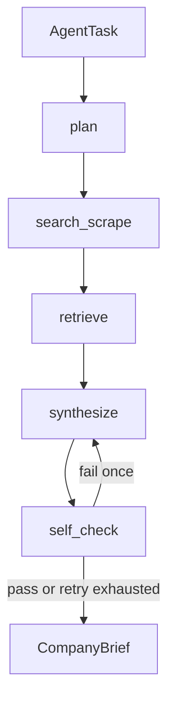

# Research Agent

Autonomous company-research subsystem for the AI-Native Job Agent architecture.

This project closes the gap between job discovery and job application by researching a target company, grounding the findings in source evidence, and producing a structured `CompanyBrief` that downstream agents can consume.

## What This Repo Does

The Research Agent is designed to sit between:

- `Gleaner`, which discovers jobs and company context
- `AlignResume`, which tailors resumes
- `Overture Outreach`, which personalizes outreach

The agent takes a company name plus job-description context, then:

1. Plans what to search.
2. Searches and scrapes public sources.
3. Chunks and indexes the content.
4. Retrieves the most relevant evidence.
5. Synthesizes a citation-backed brief.
6. Self-checks the output and strips unsupported claims.

## Current Implementation Status

This repo is implemented through **Phase 2** of the implementation plan.

Completed phases:

- **Phase 0**: schemas, frozen eval fact set, and compatibility note
- **Phase 1**: search, scrape, chunking, embedding, local retrieval
- **Phase 2**: graph state, node orchestration, synthesis, self-check, retry-once loop

Not yet implemented:

- **Phase 3**: observability logger, formal eval runner, CI regression gate
- **Phase 4**: packaging, interview docs, downstream integration tests

## Architecture

The long-term architecture follows the planning docs in this repo:

- [Research_Agent_Problem_Statement.md](./Research_Agent_Problem_Statement.md)
- [Research_Agent_Mission_Plan.md](./Research_Agent_Mission_Plan.md)
- [Research_Agent_Architecture_Design_Plan.md](./Research_Agent_Architecture_Design_Plan.md)
- [Phase_Wise_Implementation_Plan_Research_Agent_Node4.md](./Phase_Wise_Implementation_Plan_Research_Agent_Node4.md)
- [Edge_Case_Registry_Research_Agent_Node4.md](./Edge_Case_Registry_Research_Agent_Node4.md)
- [Evaluation_Plan_Research_Agent_Node4.md](./Evaluation_Plan_Research_Agent_Node4.md)

### Runtime Flow

The current graph runs in this order:



### Key Design Notes

- The graph is currently a lightweight explicit state machine implemented in Python.
- The vector store is a local SQLite-backed store for now.
- The self-check step is heuristic and citation-aware, with a single retry cap.
- The code is structured so it can be swapped to a fuller LangGraph + Chroma stack later without changing the high-level workflow.

## Repository Layout

```text
Research-Agent/
+-- graph/                  # Orchestration, graph state, and node logic
+-- pipeline/               # Chunking, embedding, retrieval, local vector store
+-- tools/                  # Search and scrape tool adapters
+-- eval/                   # Frozen fact set and Gate 1 validation
+-- scripts/                # Phase validators
+-- schemas/                # Pydantic contracts for agent outputs and inputs
+-- specs/notes/            # Audit notes and compatibility notes
+-- .github/workflows/      # GitHub Actions gate for the frozen fact set
+-- README.md               # Project overview and usage
+-- docs/                   # Additional documentation and notes
```

## Core Contracts

### `CompanyBrief`

The Research Agent outputs a `CompanyBrief` with:

- `company_name`
- `summary`
- `tech_signals`
- `recent_news`
- `culture_notes`
- `confidence_flags`
- `citations`
- `run_metadata`

### `AgentTask`

The Conductor-facing task envelope contains:

- `task_id`
- `agent_name`
- `input_payload`
- `status`
- `result`
- `retry_count`
- `timestamp`

### Chunk Record

Internally, retrieved content is stored as chunk records with:

- `chunk_id`
- `text`
- `embedding`
- `source_url`
- `scraped_at`
- `company_name`

## How To Run

### Gate 1

Validate the frozen evaluation dataset:

```bash
python eval/validate_fact_set.py
```

Or:

```bash
npm run gate1
```

### Phase 1

Validate the retrieval core:

```bash
python scripts/validate_phase1.py
```

Or:

```bash
npm run phase1
```

### Phase 2

Validate the graph orchestration and self-check path:

```bash
python scripts/validate_phase2.py
```

Or:

```bash
npm run phase2
```

### Makefile Targets

If `make` is installed:

```bash
make gate1
make phase1
make phase2
```

## Current Validation Guarantees

The validators currently confirm:

- the frozen fact set has the expected shape and metadata
- the retrieval path preserves `chunk_id` and `source_url`
- the graph produces a non-empty `CompanyBrief`
- fabricated claims are detected and flagged by self-check
- the command-line entry points work through both Python and `npm`

## Known Gaps

The implementation is intentionally smaller than the long-term architecture in a few places:

- `langgraph` is not wired in yet; the graph is implemented as an explicit Python orchestrator.
- `Chroma` is not wired in yet; the current store is SQLite-backed for local reliability.
- the self-check is heuristic rather than a full semantic verifier.
- Phase 3 and Phase 4 artifacts are still pending.

## Project Notes

- The frozen fact set has been manually audited and is treated as a Gate 1 dependency.
- The edge-case registry and evaluation plan are kept alongside the code so implementation choices stay tied to measurable failure modes.
- The repo is intentionally structured so the implementation phases can be verified independently before moving forward.

## Recommended Next Step

If you are extending the project, the natural next milestone is **Phase 3**:

- add observability logging
- build the eval runner
- wire the CI regression gate
