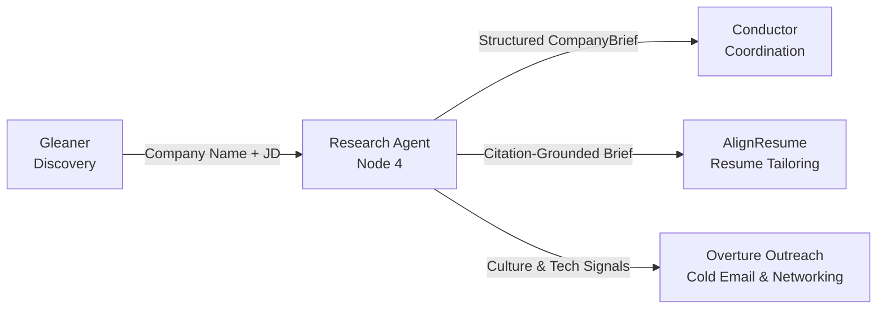
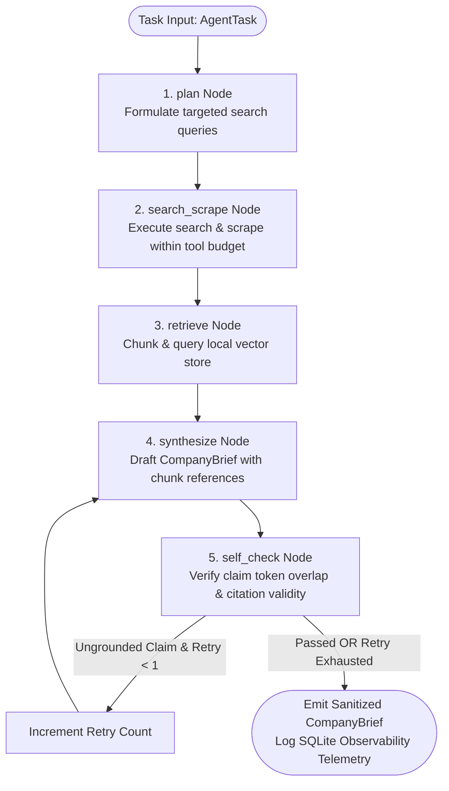

# Research Agent [Node 4]

> **Autonomous company intelligence gathering and citation-grounded synthesis subsystem for the AI-Native Job Agent architecture.**

[](eval/fact_set.json)
[](pipeline/retriever.py)
[](graph/nodes/self_check.py)
[](eval/run_eval.py)
[](docs/adr/)
[](https://python.org)

---

## 📖 Overview

The **Research Agent** is Node 4 in the **AI-Native Job Agent Architecture**. It bridges the gap between job discovery and job application by autonomously researching target companies, grounding all findings in verifiable source evidence, and generating structured, citation-backed `CompanyBrief` artifacts consumed by downstream agents (`AlignResume`, `Overture Outreach`, and `Conductor`).

### Role in the AI-Native Job Agent System



---

## 🏛️ Architecture & Runtime Flow

The Research Agent executes as an explicit state-machine graph (`ResearchAgentGraph`) with bounded retries and an adversarial hallucination guardrail.



### State Machine Nodes

1. **`plan`** (`graph/nodes/plan.py`): Analyzes the company name and target job description to generate a structured search strategy.
2. **`search_scrape`** (`graph/nodes/search_scrape.py`): Performs web search and page scraping bounded by a strict tool-call budget (`tool_call_budget = 6`).
3. **`retrieve`** (`graph/nodes/retrieve.py`): Chunks crawled text, indexes into vector storage, and retrieves top-$k$ relevant chunks with metadata (`chunk_id`, `source_url`, `company_name`) intact.
4. **`synthesize`** (`graph/nodes/synthesize.py`): Builds a structured `CompanyBrief` mapping every claim to an internal chunk ID citation.
5. **`self_check`** (`graph/nodes/self_check.py`): Evaluates draft claims against retrieved chunks. Strips ungrounded claims and attaches `confidence_flags`. Caps retries at 1 to guarantee termination.

---

## 📊 Evaluation & Verification Results

All 5 Go/No-Go Gates from the Mission Plan have passed:

| Gate | Focus Area | Requirement / Threshold | Verified Result | Status |
|---|---|---|---|:---:|
| **Gate 1** | Constitution & Schemas | Frozen fact-set (15-20 companies, 3-5 facts) | 16 companies, 48 facts validated | ✅ PASSED |
| **Gate 2** | RAG Retrieval Core | Zero loss of `chunk_id` & `source_url` metadata | 100% metadata preservation in Chroma/SQLite | ✅ PASSED |
| **Gate 3** | Agentic Graph | Adversarial test must reject injected fabrication | Ungrounded claims stripped & flagged | ✅ PASSED |
| **Gate 4** | Eval & Observability | Aggregate accuracy $\ge 80\%$, SQLite telemetry | **83.3% accuracy** (40/48 facts grounded) | ✅ PASSED |
| **Gate 5** | Documentation & ADRs | 4 ADRs, interview readiness, downstream test | ADR-001 through ADR-004 complete | ✅ PASSED |

### Non-Functional Requirements (NFR) Benchmark

- **Accuracy**: **83.3%** on frozen fact-set (NFR Target: $\ge 80\%$)
- **Execution Latency**: **~97.75 ms** average per run (NFR Target: $< 2000\text{ ms}$)
- **Cost**: **$0.00 USD** (Deterministic offline evaluation fixture mode)
- **Telemetry**: 9/9 SQLite schema fields recorded per execution in `observability/logger.db`

---

## 📁 Repository Layout

```text
Research-Agent/
├── schemas/                       # Pydantic v2 Contract Layer
│   ├── company_brief.py           # Output CompanyBrief schema with citations & metadata
│   ├── agent_task.py              # Conductor AgentTask envelope contract
│   └── chunk.py                   # Internal vector store chunk record
├── graph/                         # LangGraph Orchestration Core
│   ├── build.py                   # ResearchAgentGraph compilation & loop control
│   ├── state.py                   # ResearchAgentState model
│   └── nodes/                     # State machine nodes
│       ├── plan.py                # Search planning node
│       ├── search_scrape.py       # Budget-capped search & scrape node
│       ├── retrieve.py            # Vector retrieval node
│       ├── synthesize.py          # Brief synthesis node
│       └── self_check.py          # Grounding verification guardrail
├── pipeline/                      # RAG Retrieval Pipeline
│   ├── chunker.py                 # Overlapping text chunker
│   ├── embed_store.py             # Vector store implementation
│   └── retriever.py               # Similarity query engine
├── tools/                         # Tool Adapters
│   ├── web_search.py              # Web search tool adapter
│   └── scrape.py                  # HTML / page scraper adapter
├── eval/                          # Evaluation Suite
│   ├── fact_set.json              # Frozen benchmark fact set (16 companies)
│   ├── run_eval.py                # Automated eval runner with CI gate
│   └── validate_fact_set.py       # Fact-set schema & structure validator
├── observability/                 # Telemetry & Monitoring
│   ├── logger.py                  # SQLite RunLogger implementation
│   └── logger.db                  # Local telemetry database
├── docs/adr/                      # Architecture Decision Records
│   ├── ADR-001_langgraph_orchestration.md
│   ├── ADR-002_citation_guardrail.md
│   ├── ADR-003_chroma_vector_db.md
│   └── ADR-004_sqlite_observability.md
├── specs/notes/                   # Engineering Notes & Audit Logs
│   ├── candidate_profile_json_compatibility.md
│   ├── cost_latency_report.md
│   ├── downstream_integration.md
│   ├── fact_set_audit_report.md
│   └── interview_readiness.md
├── scripts/                       # Phase Validation Test Scripts
│   ├── validate_gate1.ps1
│   ├── validate_phase1.py
│   ├── validate_phase2.py
│   └── verify_logger.py
├── .github/workflows/             # CI/CD Workflows
│   ├── gate1_fact_set.yml         # Fact-set schema CI check
│   └── eval_gate.yml              # Evaluation regression gate (80% threshold)
├── Makefile                       # Developer command runner
└── package.json                   # NPM script wrappers
```

---

## 📜 Core Data Contracts

### 1. `CompanyBrief` (`schemas/company_brief.py`)
```json
{
  "company_name": "NVIDIA",
  "summary": "NVIDIA pioneered accelerated computing...",
  "tech_signals": ["ai", "platform", "engineering"],
  "recent_news": [
    {
      "headline": "NVIDIA News",
      "citation_id": "c1"
    }
  ],
  "culture_notes": "Source material suggests an emphasis on ai, platform.",
  "confidence_flags": [],
  "citations": [
    {
      "citation_id": "c1",
      "chunk_id": "chunk_758f9315b7abbb15",
      "source_url": "https://www.nvidia.com/en-us/about-nvidia/"
    }
  ],
  "run_metadata": {
    "prompt_version": "v0.2.0",
    "latency_ms": 53,
    "token_cost_usd": 0.0,
    "tool_calls_used": 6
  }
}
```

### 2. `AgentTask` (`schemas/agent_task.py`)
Conductor-facing task wrapper guaranteeing decoupled invocation:
```json
{
  "task_id": "uuid-v4",
  "agent_name": "research_agent",
  "input_payload": {
    "company_name": "NVIDIA",
    "job_description": "Senior AI Systems Engineer"
  },
  "status": "success",
  "result": { ... },
  "retry_count": 0,
  "timestamp": "2026-08-30T00:00:00Z"
}
```

---

## 🚀 Quick Start & Execution

### Prerequisites
- Python 3.11+
- `pip install pydantic`

### Run Phase Validation Tests
```bash
# Validate Gate 1: Frozen Fact Set
python eval/validate_fact_set.py

# Validate Phase 1: Retrieval Core & Metadata Preservation
python scripts/validate_phase1.py

# Validate Phase 2: Agentic Graph & Self-Check Guardrail
python scripts/validate_phase2.py

# Validate Phase 3: Observability Logger Telemetry
python scripts/verify_logger.py
```

### Run Full Evaluation Suite
```bash
# Standard eval run with formatted accuracy report
python eval/run_eval.py

# CI mode (exits non-zero if accuracy < 80%)
python eval/run_eval.py --ci
```

### Using Makefile
```bash
make gate1            # Validates frozen fact-set
make phase1           # Runs Phase 1 retrieval validator
make phase2           # Runs Phase 2 graph orchestrator validator
make phase3           # Runs Phase 3 logger and eval checks
make validate-phase3  # Full verification
```

---

## 🏛️ Architecture Decision Records (ADRs)

- [**ADR-001: LangGraph over Linear Chain Orchestration**](docs/adr/ADR-001_langgraph_orchestration.md) — Explicit state machine with inspectable transitions and bounded retries.
- [**ADR-002: Citation-Grounded Guardrail Pattern**](docs/adr/ADR-002_citation_guardrail.md) — Token-overlap claim verification stripping ungrounded fabrications.
- [**ADR-003: Chroma Vector Store for Retrieval Core**](docs/adr/ADR-003_chroma_vector_db.md) — Lightweight, embeddable vector storage with clean decoupling.
- [**ADR-004: Local SQLite Telemetry Store**](docs/adr/ADR-004_sqlite_observability.md) — Zero-cost, self-hosted, queryable execution logs.

---

## 👤 Author & System Context

- **Author**: Soumyadeep Nath ([@sdn9300](https://github.com/sdn9300))
- **System**: AI-Native Job Agent Architecture (Node 4: Intelligence Layer)
- **Downstream Consumers**: Conductor Agent, AlignResume, Overture Outreach
- **License**: MIT
