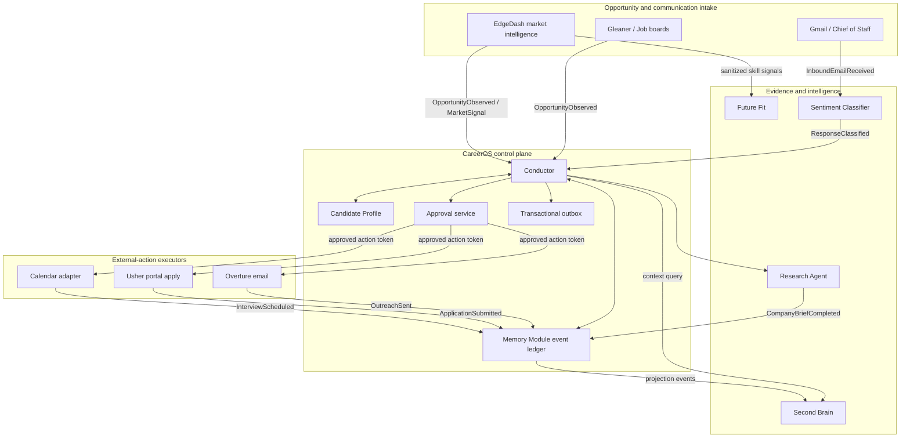

# CareerOS Platform — Architecture Design

## 1. Architecture decision

CareerOS is a **modular control plane with event-driven integration**, not a full code merge and not a collection of peer orchestrators.

The architecture adopts four decisions:

1. **Conductor is the sole application-lifecycle orchestrator.**
2. **Candidate Profile and Memory Module are the canonical data spine.**
3. **Second Brain, EdgeDash, Chief of Staff, Research, Future Fit, Overture, and Usher connect through bounded adapters and versioned contracts.**
4. **Approval is a durable, centrally validated action authorization, not a component-local UI flag.**

## 2. Logical topology



## 3. Component boundaries

### 3.1 Core control plane

#### Conductor

Conductor receives a normalized opportunity or inbound communication signal, evaluates policy, runs the applicable graph nodes, creates action requests, and persists durable outcomes. It never becomes the source of candidate identity or business history; it coordinates the owners of those facts.

Conductor must not accept a direct command to send an email or submit a form. It can only produce an action request; the approval service and action executor complete the controlled sequence.

#### Candidate Profile

Candidate Profile owns the candidate's identity, contact information, work history, verified skills, evidence references, career preferences, consent settings, and resume baselines. Its deterministic projection functions are the only supported way for agents to obtain candidate-shaped data.

`application_history` is a convenience projection, not an authority for lifecycle status. Application state belongs to the event ledger.

#### Memory Module

Memory Module owns immutable business events and deterministic materialized application state. It supplies:

- idempotent event persistence;
- canonical application status;
- URL and normalized company/title deduplication;
- domain cooldown checks;
- state replay and history queries;
- action outcome history.

The Memory Module is a sink-and-source, not an orchestrator. It does not call an LLM or initiate an action.

#### Approval service

The approval service owns `ApprovalRequest` and `ApprovalDecision` records. It validates policy, expiry, artifact hashes, intended target, user decision, and execution mode. Approval is scoped to exactly one action payload. Changing the recipient, file, answers, or free-text body invalidates approval and requires a new decision.

### 3.2 Intake and intelligence adapters

#### Gleaner and EdgeDash

Gleaner remains the board-adapter and collection layer. EdgeDash remains the market-intelligence layer for scoring, gaps, and market queries. Both publish normalized observations; neither creates applications, writes lifecycle state directly, or sends outreach.

A shared entity-resolution service decides whether two observations describe the same opportunity. This prevents the same job appearing as separate application candidates merely because it was found through RemoteOK, Indeed, a company career page, or EdgeDash.

#### Research Agent

Research Agent receives a bounded task containing company name, job description, candidate research scope, and correlation metadata. It returns a `CompanyBrief` with source citations, confidence flags, evidence metadata, and run telemetry. Conductor records the result; Second Brain archives it as an artifact projection.

#### Second Brain

Second Brain remains the local-first evidence vault, Graph-RAG system, and human-readable case workspace. It has two integration modes:

- **Query mode:** Conductor or a drafting component requests bounded, cited context.
- **Projection mode:** a worker ingests redacted job artifacts and lifecycle summaries from committed ledger events.

Second Brain must not be in the synchronous write path for an application transition. Its notes may lag briefly and can be rebuilt. A semantic answer can inform a human decision, but deterministic cooldown, approval, and provenance checks remain in the core plane.

#### Chief of Staff and Sentiment Classifier

Chief of Staff is the recruiter-inbox and interaction surface. It fetches or receives Gmail threads, provides UI-oriented priority triage and draft context, and stages a proposed reply or calendar action. Sentiment Classifier supplies the canonical recruiter-response classification signal.

The integration sequence is:

1. identify or request resolution of `application_id` for an inbound thread;
2. classify the message with a documented confidence and taxonomy version;
3. append `ResponseClassified` to the event ledger;
4. derive cooldown or interview state through the event store;
5. stage a reply or calendar action as an approval request;
6. execute only after central approval.

#### Future Fit

Future Fit consumes de-identified skill-demand signals from jobs and recruiter communication. It does not consume raw email bodies by default and does not make application decisions. Its output is advisory context for opportunity scoring and learning plans.

### 3.3 Action executors

#### Overture

Overture receives an approved outreach command, a deterministic candidate projection, cited company/job context, and a draft artifact hash. It records `OutreachAttempted` and either `OutreachSent` or `OutreachFailed`. It must not retry a live send without checking idempotency and approval validity.

#### Usher

Usher receives an approved application-submission command, a validated application view, tailored resume artifact, and the correct submission mode. It can autonomously fill deterministic fields but must stage for review when CAPTCHA, authentication, unknown field mapping, suspicious site behavior, or LLM-generated free text is encountered.

#### Calendar adapter

The calendar adapter receives an approved booking command with a parsed proposal, time zone, attendees, and conflict-check result. It records `InterviewScheduled`, `CalendarConflictDetected`, or `CalendarBookingFailed` with the external event ID when available.

## 4. Data architecture

### 4.1 Source-of-truth matrix

| Domain data | Authoritative store | Read models / projections |
|---|---|---|
| Candidate facts and verified evidence | Candidate Profile | resume profile, research scope, outreach context, Usher profile |
| Opportunity identity and application lifecycle | Memory Module event ledger | Conductor state, Candidate Profile application summary, dashboards, Second Brain notes |
| Workflow progress and retries | Conductor checkpoint store | run viewer and operational logs |
| Approval decisions | Approval service ledger | Chief of Staff and operator-console queues |
| Artifacts and human-readable knowledge | Second Brain raw/vault plus object storage references | RAG results, Obsidian notes, case views |
| Market data and skill analytics | EdgeDash / Future Fit stores | scorecards and planning views |
| Runtime telemetry | observability store | metrics, traces, alerts |

### 4.2 Canonical identities

| Identifier | Creation point | Purpose |
|---|---|---|
| `candidate_id` | Candidate Profile | Stable candidate identity. |
| `opportunity_id` | intake/entity resolution | Stable normalized posting identity. |
| `application_id` | Conductor after qualification | Joins every application lifecycle event. |
| `thread_id` | Gmail / Chief of Staff | External communication identity linked to an application. |
| `artifact_id` | artifact store / Second Brain projection | Content-addressed resume, JD, brief, email, screenshot, or transcript. |
| `approval_id` | Approval service | One authorization for one immutable action payload. |
| `run_id` / `correlation_id` | Conductor | Traces one orchestration attempt across services. |

### 4.3 Event contract

Every business event must use this envelope:

```json
{
  "event_id": "uuid",
  "schema_version": "1.0",
  "event_type": "application.submitted",
  "occurred_at": "2026-08-30T00:00:00Z",
  "producer": "usher",
  "candidate_id": "uuid",
  "application_id": "uuid",
  "correlation_id": "uuid",
  "causation_id": "uuid-or-null",
  "idempotency_key": "stable-hash",
  "payload": {},
  "payload_hash": "sha256",
  "pii_classification": "restricted",
  "mode": "dry_run"
}
```

Initial event taxonomy:

```text
opportunity.observed
opportunity.qualified
opportunity.duplicate_detected
application.created
company_brief.completed
resume.tailored
approval.requested
approval.decided
outreach.attempted
outreach.sent
application.attempted
application.submitted
inbound_email.received
response.classified
interview.proposed
interview.scheduled
application.rejected
application.offered
artifact.recorded
projection.failed
```

Current component-specific event names can be mapped during migration. New cross-component code must not introduce a second taxonomy.

### 4.4 Transactional outbox and delivery

The durable event ledger is the record of truth. A transactional outbox records events in the same transaction as the resulting state change. A dispatcher forwards events to projection workers and analytics consumers.

The system assumes at-least-once delivery. Therefore, every consumer must deduplicate on `event_id` or its explicit `idempotency_key`. A delivery acknowledgement is not proof that an external side effect occurred; external executors record their own confirmed outcome event.

### 4.5 Artifact and PII policy

- Store raw resumes, emails, PDFs, screenshots, and transcripts as restricted artifacts with content hashes and access-controlled references.
- Store only minimal, redacted summaries in general event payloads and telemetry.
- Do not put API keys, OAuth tokens, cookie data, full resume text, or raw email bodies into logs, dashboards, or analytics exports.
- Attach provenance metadata to derived artifacts: source artifact IDs, model/provider, prompt version, time, guardrail outcome, and reviewer decision.

## 5. Interface strategy

### 5.1 Contract package

Create `career_os_contracts` as a small versioned Python package containing Pydantic models, JSON Schemas, event registry, API error types, and contract fixtures. TypeScript schemas for the operator console should be generated from the same JSON Schema where feasible.

### 5.2 Synchronous interfaces

Use synchronous calls only for bounded queries and commands where the caller requires an immediate response:

- candidate projection lookup;
- cooldown and deduplication query;
- bounded RAG/context query;
- research invocation with timeout;
- action-preparation command;
- approval validation immediately before execution.

MCP is appropriate for local agent/tool discovery and bounded read/write tools. It is not the durable event transport.

### 5.3 Asynchronous interfaces

Use events for durable facts and rebuildable projections:

- application lifecycle changes;
- vault note creation;
- analytics signal ingestion;
- dashboard updates;
- notification generation;
- retry scheduling and dead-letter handling.

### 5.4 Error model

Every interface returns a structured result with `status`, `error_code`, `retryable`, `correlation_id`, and safe human-readable message. Errors are never represented by a fabricated success result.

## 6. Approval and policy architecture

### 6.1 Approval request

An approval request contains:

- `approval_id`, `candidate_id`, and `application_id`;
- action type: `send_email`, `submit_application`, `book_calendar`, or `update_profile`;
- immutable action payload hash;
- intended target: recipient, portal URL, or calendar details;
- attached artifacts and evidence;
- risk flags and required review fields;
- policy version, created time, and expiry;
- default mode: `dry_run`.

### 6.2 Approval decision

The candidate can approve, approve-with-edits, reject, defer, or abort. An edit creates a new action payload and invalidates the previous approval. The executor validates the decision's scope, hash, target, mode, and expiry before acting.

### 6.3 Policy controls

Policy checks include domain cooldown, daily outreach limits, duplicate thread detection, candidate consent, verified-company requirements, artifact availability, free-text risk, CAPTCHA/authentication detection, and platform trust level.

## 7. Deployment architecture

### 7.1 Local-first development

Start with Docker Compose or a documented local-process profile:

- Conductor service and worker;
- Candidate Profile and Memory Module stores;
- local artifact directory;
- Second Brain MCP service;
- EdgeDash MCP service;
- optional Postgres-compatible integration database;
- Prometheus-compatible metrics endpoint.

SQLite remains valid for isolated component development. The platform must keep storage interfaces clean so a deployed ledger can use Postgres without changing domain semantics.

### 7.2 Deployed evolution

When concurrent workers, remote access, or durable multi-process delivery is required, move the core ledger/outbox to Postgres and use a lightweight durable broker such as NATS JetStream. Do not introduce Kubernetes until deployment complexity, reliability targets, and operating load justify it.

## 8. Repository layout and dependency policy

Create a new integration repository rather than copying code from existing projects. Existing Git repositories remain independent. During integration, use declared editable packages or pinned versions; only use Git submodules after each upstream repository and release boundary is explicitly catalogued.

EdgeDash should be promoted to a governed package/repository before it is relied on as a production integration dependency. Duplicate source trees within a component must be resolved by a baseline certification step before they are published as platform dependencies.

## 9. Architecture decision records to create

1. **ADR-CAREEROS-001:** Conductor is the sole lifecycle coordinator.
2. **ADR-CAREEROS-002:** Candidate Profile and Memory Module ownership boundaries.
3. **ADR-CAREEROS-003:** Event envelope, outbox, and at-least-once delivery model.
4. **ADR-CAREEROS-004:** Central approval validation and action-token semantics.
5. **ADR-CAREEROS-005:** Second Brain is an evidence projection, not lifecycle authority.
6. **ADR-CAREEROS-006:** EdgeDash and Gleaner publish opportunities; neither creates applications.
7. **ADR-CAREEROS-007:** Credential and PII isolation rules.

## 10. Explicit anti-patterns

- Do not allow EdgeDash, Second Brain, or Chief of Staff to independently advance an application lifecycle.
- Do not use a semantic RAG answer as a substitute for a deterministic cooldown, identity, or approval check.
- Do not share `.env`, OAuth tokens, browser sessions, or credential files between projects.
- Do not add new relative path imports across repositories.
- Do not write full raw email/resume content to event logs or telemetry.
- Do not retain a second untracked copy of an application's current status.
- Do not make live execution the default mode.
