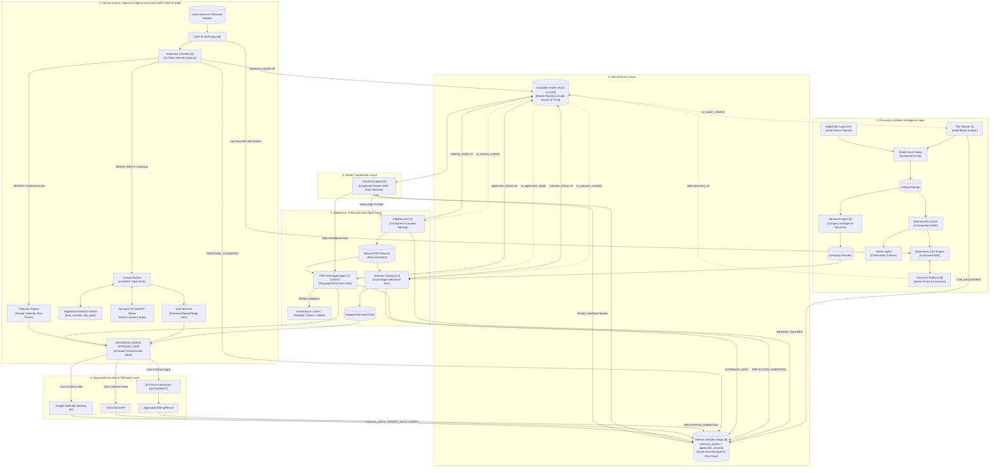

# UNIFIED CAREEROS: DETAILED ARCHITECTURE DESIGN
## Master Topology, 10 Subsystem Specifications, FastMCP Tool Mesh, and Canonical Data Contracts

**Document ID:** CAREEROS-ARCH-v2.2  
**Status:** Approved Technical Architecture  
**Scope:** Complete Architectural Specification for 10-Component Ecosystem

---

## 1. System Overview & Architectural Topology

The Unified AI-Native Career Operating System (CareerOS) coordinates 10 specialized agent subsystems anchored by **Candidate Profile JSON [10]**, recorded by **Memory Module [8]**, orchestrated by **Conductor Agent [0]**, and communicating over **FastMCP**:



---

## 2. Complete 10-Component Subsystem Specifications

### Subsystem [0]: Conductor Agent (LangGraph Master State Machine)
* **Location:** `c:\My Projects\AI Native Job Agent Project\Conductor Agent`
* **Role:** Central orchestrator managing the DAG state transitions:
  $$\text{Discovered} \rightarrow \text{Scored} \rightarrow \text{Researched} \rightarrow \text{Tailored} \rightarrow \text{Staged} \rightarrow \text{Submitted/Sent} \rightarrow \text{Triaged} \rightarrow \text{Scheduled} \rightarrow \text{Persisted}$$
* **Protocol Contract:** Hosts `CandidateProfile` as LangGraph shared state; executes `merge_candidate_profile()` reducer; queries Memory Module for routing decisions.

### Subsystem [1]: The Gleaner (Job Scraping / Gleaner)
* **Location:** `c:\My Projects\AI Native Job Agent Project\Job Scraping`
* **Role:** Multi-board scraper (LinkedIn, Indeed, Glassdoor, RemoteOK, Arbeitnow) with deduplication via `SHA256(source + url)`. Reads search preferences via `to_search_criteria(profile.preferences)`. Emits `JOB_DISCOVERED` events.

### Subsystem [2]: AlignResume (Resume Builder Project)
* **Location:** `c:\My Projects\AI Native Job Agent Project\Resume Builder Project`
* **Role:** Tailors master resume against target JD; consumes `to_resume_profile(profile)`; enforces truthfulness constraints against `SourceProvenance.verified`; outputs `ResumeArtifact`. Writes summary refs to `tailoring_history` and emits `RESUME_TAILORED` events.

### Subsystem [3]: Overture Outreach (cold-email-agent)
* **Location:** `c:\My Projects\AI Native Job Agent Project\cold-email-agent`
* **Role:** Dual-stage cold email generator; consumes `to_outreach_context(profile)`; outputs personalized drafts into the Approval Gate. Writes summary refs to `outreach_history` and emits `OUTREACH_SENT` events.

### Subsystem [4]: Research Agent (Node 4)
* **Location:** `c:\My Projects\AI Native Job Agent Project\Research-Agent`
* **Role:** Reads target role/industry preferences from profile; generates `CompanyBrief` dossiers (funding runway, engineering tech stack, key leadership). Emits `DOSSIER_COMPILED` events.

### Subsystem [5]: Future-Fit Platform (Skill Trend Analysis)
* **Location:** `c:\My Projects\AI Native Job Agent Project\Skill Trend Analysis`
* **Role:** Apriori market basket analysis and skill demand forecasting across historical job postings. Exports canonical skill taxonomy matching `SkillRecord.taxonomy_ref`. Emits `SKILL_GAP_EVALUATED` events.

### Subsystem [6]: MCP Chief of Staff (Action Hub)
* **Location:** `c:\My Projects\Masai Live Docs\MCP Chief of Staff`
* **Role:** Gmail OAuth2 ingestion/send; 4-tier triage; Google Calendar auto-parser; FastMCP Hub; host of the Universal Human Approval Gate. Emits `INTERVIEW_SCHEDULED` events.

### Subsystem [7]: PDF Auto-Apply Agent ("Usher")
* **Location:** `c:\My Projects\AI Native Job Agent Project\PDF Auto Apply Agent`
* **Role:** Headless browser automation (Playwright) completing final-mile job application forms across ATS platforms. Consumes `to_application_view(profile)`. Writes summary refs to `application_history` and emits `APPLICATION_SUBMITTED` events.

### Subsystem [8]: Memory Module (Event-Sourced Application Ledger)
* **Location:** `c:\My Projects\AI Native Job Agent Project\Memory Module`
* **Role:** Pure sink-and-source learning layer component that durably records every event in the application lifecycle and derives current state.
* **Architecture:** Event sourcing hybrid (`memory_events` + `application_records` + `status_transitions` + `domain_cooldowns`) with deterministic replay (`rebuild_derived_state()`).

### Subsystem [9]: Sentiment Classifier (Node 9)
* **Location:** `c:\My Projects\AI Native Job Agent Project\Sentiment-Analysis`
* **Role:** 12-class recruiter intent & urgency classifier. Writes summary refs to `interaction_signals` and emits `RESPONSE_CLASSIFIED` events to Memory Module.

### Subsystem [10]: Candidate Profile JSON & Engine (Master Anchor)
* **Location:** `c:\My Projects\AI Native Job Agent Project\Candidate Profile`
* **Role:** Canonical data store and anchoring schema defining validated candidate facts (`identity`, `education`, `skills`, `experience`, `preferences`). Serves as the single source of truth across all 9 agents.

---

## 3. Candidate Profile JSON Data Model & Subsystem Integration

### 3.1 Pydantic v2 Canonical Schemas (`candidate_profile/schemas.py`)

```python
from __future__ import annotations
from datetime import datetime
from enum import Enum
from typing import Any, Optional, List
from pydantic import BaseModel, ConfigDict, EmailStr, Field, HttpUrl

class ProficiencyLevel(str, Enum):
    BASIC = "basic"
    EARLY_PRACTICAL = "early_practical"
    INTERMEDIATE = "intermediate"
    ADVANCED = "advanced"

class SourceProvenance(BaseModel):
    """Attached to claim-bearing fields (skills, experience) — truthfulness anchor."""
    model_config = ConfigDict(extra="forbid")
    source_type: str                    # "resume_v12" | "manual_entry" | "llm_extracted"
    source_ref: Optional[str] = None    # e.g. groq model id, source filename
    verified: bool = False              # Human-confirmed flag
    recorded_at: datetime

class ContactInfo(BaseModel):
    model_config = ConfigDict(extra="forbid")
    email: EmailStr
    phone: Optional[str] = None
    linkedin: Optional[HttpUrl] = None
    github: Optional[HttpUrl] = None
    portfolio: Optional[HttpUrl] = None

class Identity(BaseModel):
    model_config = ConfigDict(extra="forbid")
    legal_name: str = Field(min_length=1)
    location: str = Field(min_length=1)
    contact: ContactInfo

class EducationRecord(BaseModel):
    model_config = ConfigDict(extra="forbid")
    institution: str
    program: str
    status: str                         # "in_progress" | "completed"
    start_date: str
    end_date: Optional[str] = None
    honors: Optional[str] = None

class SkillRecord(BaseModel):
    model_config = ConfigDict(extra="forbid")
    name: str
    taxonomy_ref: Optional[str] = None # Soft-link to Future-Fit taxonomy slug (ADR-CP-6)
    proficiency_self_assessed: ProficiencyLevel
    evidence_refs: List[str] = Field(default_factory=list)
    source: SourceProvenance

class ExperienceRecord(BaseModel):
    model_config = ConfigDict(extra="forbid")
    title: str
    kind: str                           # "project" | "employment" | "tutoring"
    stack: List[str] = Field(default_factory=list)
    bullets: List[str] = Field(default_factory=list)
    live_url: Optional[HttpUrl] = None
    repo_url: Optional[HttpUrl] = None
    source: SourceProvenance

class ApplicationPreferences(BaseModel):
    model_config = ConfigDict(extra="forbid")
    target_roles: List[str] = Field(min_length=1)
    target_industries: List[str] = Field(default_factory=list)
    locations: List[str] = Field(min_length=1)
    remote_ok: bool = True
    seniority_qualifiers: List[str] = Field(default_factory=list)

class HistoryRef(BaseModel):
    """Lightweight summary reference into owning component store (ADR-CP-3)."""
    model_config = ConfigDict(extra="forbid")
    run_id: str
    component: str
    timestamp: datetime
    outcome: str
    score: Optional[float] = None
    detail_ref: str                     # Pointer to full artifact in owning store

class ProfileMetadata(BaseModel):
    model_config = ConfigDict(extra="forbid")
    candidate_id: str                   # UUID; single-tenant today, multi-tenant ready
    schema_version: str = "1.0.0"
    created_at: datetime
    updated_at: datetime
    last_writer_component: str

class CandidateProfile(BaseModel):
    """The single canonical source of truth for candidate facts."""
    model_config = ConfigDict(extra="forbid")
    profile_metadata: ProfileMetadata
    identity: Identity
    education: List[EducationRecord]
    skills: List[SkillRecord]
    experience: List[ExperienceRecord]
    preferences: ApplicationPreferences
    tailoring_history: List[HistoryRef] = Field(default_factory=list)
    outreach_history: List[HistoryRef] = Field(default_factory=list)
    application_history: List[HistoryRef] = Field(default_factory=list)
    interaction_signals: List[HistoryRef] = Field(default_factory=list)
```

### 3.2 Field Ownership & Update-Pattern Matrix

```
+---------------------------------------------------------------------------------------------------------------+
|                                      FIELD OWNERSHIP & UPDATE PATTERN MATRIX                                  |
+---------------------+-----------------------------------+------------------------------------+----------------+
| Section             | Authoritative Writer              | Readers                            | Update Pattern |
+---------------------+-----------------------------------+------------------------------------+----------------+
| profile_metadata    | Conductor [0] (System-managed)    | All Components                     | Auto-updated   |
| identity            | Human-Gated Bootstrap / Manual    | AlignResume [2], Usher [7], Overture| Overwrite (HG) |
| education           | Human-Gated Bootstrap / Manual    | AlignResume [2], Usher [7]         | Overwrite (HG) |
| skills              | Human-Gated Bootstrap / Extractor | AlignResume [2], Usher [7], FutureFit| Key-merge (HG)|
| experience          | Human-Gated Bootstrap / Manual    | AlignResume [2], Usher [7], Overture| Append/Edit (HG)|
| preferences         | Human-Gated Manual                | Gleaner [1], Research Agent [4]  | Overwrite (HG) |
| tailoring_history   | AlignResume [2] (refs only)       | Usher [7], Conductor [0]           | Append-only    |
| outreach_history    | Overture [3] (refs only)          | Sentiment [9], Conductor [0]       | Append-only    |
| application_history | PDF Auto-Apply [7] (refs only)    | Conductor [0], Memory Module [8]   | Append-only    |
| interaction_signals | Sentiment Classifier [9] (refs)   | Conductor [0], Memory Module [8]   | Append-only    |
+---------------------+-----------------------------------+------------------------------------+----------------+
```

### 3.3 LangGraph State Reducer (`merge_candidate_profile`)

```python
OWNERSHIP = {
    "bootstrap": {"identity", "education", "skills", "experience", "preferences"},
    "align_resume": {"tailoring_history"},
    "overture": {"outreach_history"},
    "pdf_auto_apply": {"application_history"},
    "sentiment_classifier": {"interaction_signals"},
    "conductor": {"profile_metadata"}
}
APPEND_ONLY_SECTIONS = {"tailoring_history", "outreach_history", "application_history", "interaction_signals"}

def merge_candidate_profile(current: CandidateProfile, patch: CandidateProfilePatch) -> CandidateProfile:
    """LangGraph-compatible deterministic state reducer enforcing strict field ownership."""
    if patch.section not in OWNERSHIP.get(patch.writer_component, set()):
        raise OwnershipViolationError(f"{patch.writer_component} cannot write to {patch.section}")

    if patch.section in APPEND_ONLY_SECTIONS:
        updated = getattr(current, patch.section) + [patch.value]
    else:
        updated = patch.value

    return current.model_copy(update={
        patch.section: updated,
        "profile_metadata": current.profile_metadata.model_copy(update={
            "updated_at": datetime.utcnow(),
            "last_writer_component": patch.writer_component
        })
    })
```

### 3.4 Mechanical Projection Adapters (Zero-Drift Ingestion)

```python
def to_resume_profile(profile: CandidateProfile) -> ResumeProfile:
    """Projects canonical facts into AlignResume's domain model."""
    return ResumeProfile(
        name=profile.identity.legal_name,
        contact=profile.identity.contact.model_dump(),
        skills=[s.name for s in profile.skills if s.source.verified],
        experience=[e.model_dump() for e in profile.experience if e.source.verified],
        education=[ed.model_dump() for ed in profile.education]
    )

def to_search_criteria(preferences: ApplicationPreferences) -> SearchCriteria:
    """Projects search preferences into Gleaner's scraping criteria."""
    return SearchCriteria(
        roles=preferences.target_roles,
        locations=preferences.locations,
        remote=preferences.remote_ok,
        seniority=preferences.seniority_qualifiers
    )

def to_outreach_context(profile: CandidateProfile) -> OutreachContext:
    """Projects identity and experience into Overture's persona builder."""
    return OutreachContext(
        sender_name=profile.identity.legal_name,
        email=profile.identity.contact.email,
        github=str(profile.identity.contact.github) if profile.identity.contact.github else None,
        key_skills=[s.name for s in profile.skills[:6] if s.source.verified]
    )

def to_application_view(profile: CandidateProfile) -> ApplicationView:
    """Projects profile facts and tailoring history into Usher form-filler."""
    return ApplicationView(
        identity=profile.identity.model_dump(),
        education=[e.model_dump() for e in profile.education],
        experience=[e.model_dump() for e in profile.experience if e.source.verified],
        tailoring_runs=profile.tailoring_history
    )
```

---

## 4. Memory Module Data Model & State Machine

### 4.1 Pydantic Schemas (`memory_module/schemas.py`)

```python
class EventType(str, Enum):
    JOB_DISCOVERED        = "job_discovered"
    RESUME_TAILORED       = "resume_tailored"
    OUTREACH_SENT         = "outreach_sent"
    APPLICATION_SUBMITTED = "application_submitted"
    RESPONSE_CLASSIFIED   = "response_classified"
    INTERVIEW_SCHEDULED   = "interview_scheduled"
    DOSSIER_COMPILED      = "dossier_compiled"
    SKILL_GAP_EVALUATED   = "skill_gap_evaluated"
    MANUAL_NOTE           = "manual_note"
    UNKNOWN               = "unknown"

class ApplicationStatus(str, Enum):
    DISCOVERED          = "discovered"
    TAILORED            = "tailored"
    OUTREACHED          = "outreached"
    APPLIED             = "applied"
    AWAITING_RESPONSE   = "awaiting_response"
    RESPONSE_RECEIVED   = "response_received"
    INTERVIEW_SCHEDULED = "interview_scheduled"
    OFFER               = "offer"
    REJECTED            = "rejected"
    GHOSTED             = "ghosted"
    WITHDRAWN           = "withdrawn"
    AMBIGUOUS_OUTCOME   = "ambiguous_outcome"
    UNKNOWN             = "unknown"

class MemoryEvent(BaseModel):
    """Append-only source of truth. Never mutated after write."""
    event_id: str = Field(description="Deterministic hash: hash(source+ref+type+occurred_at)")
    event_type: EventType
    source_component: str
    application_id: Optional[str] = None
    job_id: Optional[str] = None
    candidate_id: Optional[str] = None  # Opaque foreign key to Candidate Profile
    domain: Optional[str] = None
    occurred_at: datetime
    ingested_at: datetime = Field(default_factory=datetime.utcnow)
    payload: dict[str, Any]
    raw_source_ref: Optional[str] = None
```

### 4.2 Storage Layer Schemas (`memory.db` with WAL Mode)

```sql
PRAGMA journal_mode=WAL;
PRAGMA busy_timeout=5000;

CREATE TABLE memory_events (
    event_id          TEXT PRIMARY KEY,
    event_type        TEXT NOT NULL,
    source_component  TEXT NOT NULL,
    application_id    TEXT,
    job_id            TEXT,
    candidate_id      TEXT,
    domain            TEXT,
    occurred_at       TEXT NOT NULL,
    ingested_at       TEXT NOT NULL,
    payload_json      TEXT NOT NULL,
    raw_source_ref    TEXT
);

CREATE TABLE application_records (
    application_id    TEXT PRIMARY KEY,
    job_id            TEXT NOT NULL,
    candidate_id      TEXT NOT NULL,
    company           TEXT NOT NULL,
    domain            TEXT,
    role_title        TEXT NOT NULL,
    status            TEXT NOT NULL,
    created_at        TEXT NOT NULL,
    last_updated      TEXT NOT NULL
);

CREATE TABLE status_transitions (
    id                  INTEGER PRIMARY KEY AUTOINCREMENT,
    application_id      TEXT NOT NULL,
    from_status         TEXT,
    to_status           TEXT NOT NULL,
    transitioned_at     TEXT NOT NULL,
    triggering_event_id TEXT NOT NULL,
    FOREIGN KEY (application_id) REFERENCES application_records(application_id),
    FOREIGN KEY (triggering_event_id) REFERENCES memory_events(event_id)
);

CREATE TABLE domain_cooldowns (
    id                  INTEGER PRIMARY KEY AUTOINCREMENT,
    domain              TEXT NOT NULL,
    rejected_at         TEXT NOT NULL,
    cooldown_expires_at TEXT NOT NULL,
    triggering_event_id TEXT NOT NULL,
    FOREIGN KEY (triggering_event_id) REFERENCES memory_events(event_id)
);
```

---

## 5. FastMCP Tool Mesh Specifications

```
+---------------------------------------------------------------------------------------------------------------+
|                                            FASTMCP TOOL DEFINITIONS                                           |
+---------------------+-------------------------------+-------------------+-------------------------------------+
| Providing Server    | Tool Name                     | Method Signature  | Return Schema                       |
+---------------------+-------------------------------+-------------------+-------------------------------------+
| Candidate Profile   | get_candidate_profile         | (candidate_id)    | CandidateProfile                    |
| Candidate Profile   | get_candidate_projection      | (projection_type) | ProjectionPayload (Resume/App/etc.) |
| Candidate Profile   | patch_candidate_section       | (section, patch)  | CandidateProfile                    |
| EdgeDash MCP        | get_best_job_matches          | (limit, min_score)| list[ListingMatch]                  |
| EdgeDash MCP        | get_skill_gap_analysis        | (limit)           | list[OpportunityCostGap]            |
| EdgeDash MCP        | get_skill_drilldown           | (skill)           | SkillDrilldownPayload               |
| Chief of Staff MCP  | parse_and_check_meeting_slot  | (thread_text)     | MeetingSlotResult                   |
| Chief of Staff MCP  | stage_reply_for_approval      | (thread_id, draft)| StagedDraftRecord                   |
| Auto-Apply MCP      | stage_application_draft       | (job_id, resume)  | ApplicationAttemptResult            |
| Research Agent MCP  | generate_company_dossier      | (domain, company) | CompanyBrief                        |
| AlignResume MCP     | tailor_resume_for_job         | (jd_text, profile)| ResumeArtifact                      |
| Memory Module MCP   | record_event                  | (event)           | IngestAck                           |
| Memory Module MCP   | get_application               | (application_id)  | ApplicationRecord                   |
| Memory Module MCP   | get_application_history       | (application_id)  | list[MemoryEvent]                   |
| Memory Module MCP   | check_domain_cooldown         | (domain)          | CooldownStatus                      |
| Memory Module MCP   | rebuild_derived_state         | ()                | RebuildReport                       |
| Sentiment Classifier| classify_recruiter_email      | (text)            | ClassifiedSignal (12-Class)         |
| Synapse-AI MCP      | search_second_brain           | (query)           | list[GroundedSnippet]               |
+---------------------+-------------------------------+-------------------+-------------------------------------+
```

---

## 6. Architecture Decision Records (ADRs)

### Candidate Profile ADRs (ADR-CP-1 through ADR-CP-6)
* **ADR-CP-1 (Canonical Schema vs. Duplicated Schemas):** One canonical schema (`CandidateProfile`); all components consume thin mechanical projections (`to_resume_profile`, `to_search_criteria`, `to_outreach_context`, `to_application_view`).
* **ADR-CP-2 (Field Ownership Partitioning):** Disjoint section ownership. History sections are append-only. Reducer raises `OwnershipViolationError` on illegal cross-writes.
* **ADR-CP-3 (Summary References in History):** Candidate Profile stores lightweight `HistoryRef` summary records (`run_id`, `outcome`, `score`, `detail_ref`); full artifacts remain in owning sub-agent stores.
* **ADR-CP-4 (Storage Substrate):** Persistence routes through Memory Module's storage engine (atomic temp-file-and-rename verification).
* **ADR-CP-5 (Explicit Versioning & `extra="forbid"`):** Semver migration chains; unknown fields rejected strictly.
* **ADR-CP-6 (Skills Taxonomy Soft Alignment):** `SkillRecord.taxonomy_ref` softly links candidate skills to Future-Fit's canonical 100+ skill taxonomy.

### Memory Module ADRs (ADR-1 through ADR-5)
* **ADR-1 (SQLite Engine in WAL Mode):** Standard library SQLite with WAL mode and `busy_timeout=5000ms`.
* **ADR-2 (Structured Ledger vs. Vector RAG):** Deterministic SQL event ledger in v1.0; Qdrant vector memory deferred to DevOps Phase 14 / Agentic AI Stage 03 capstone.
* **ADR-3 (FastMCP Tool Interface):** MemoryStore exposed as an importable class and FastMCP server.
* **ADR-4 (Event Sourcing Hybrid):** `memory_events` append-only source of truth; derived views 100% rebuildable via `rebuild_derived_state()`.
* **ADR-5 (Deterministic Idempotency):** `event_id = sha256(source + ref + type + occurred_at)`.
