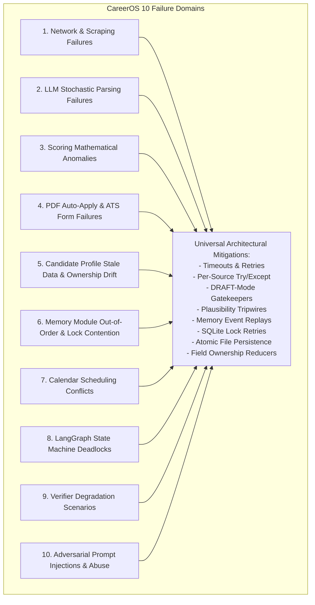
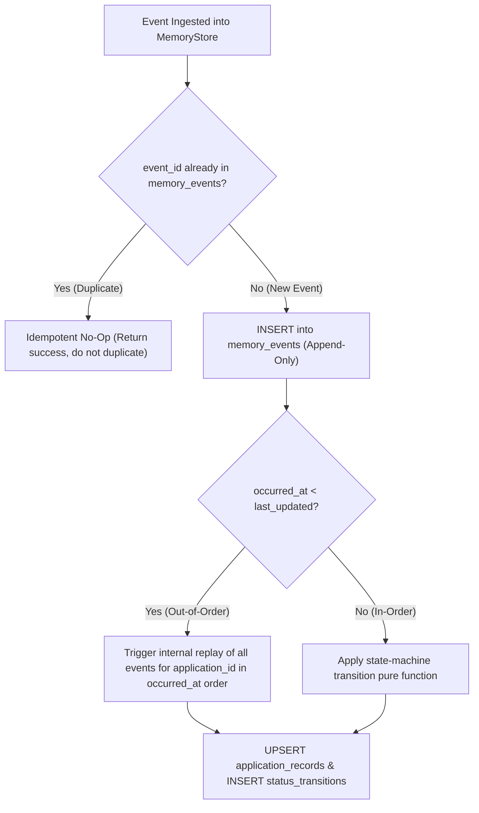
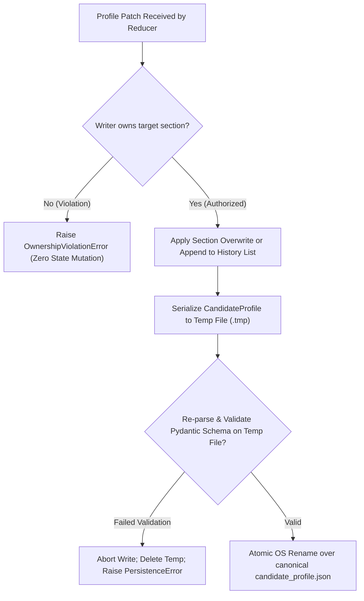
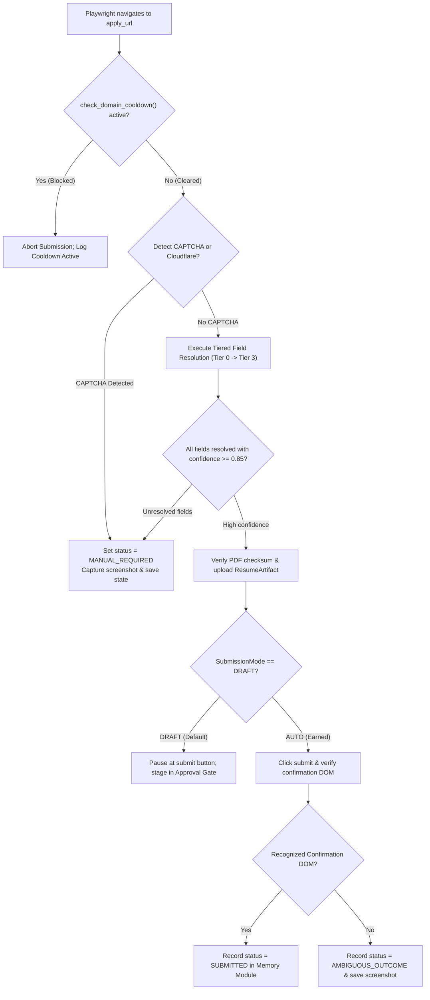

# UNIFIED CAREEROS: COMPREHENSIVE EDGE CASES PLAN
## Multi-Domain Failure Surfaces, Root Cause Analyses, Architectural Mitigations, and Recovery Protocols

**Document ID:** CAREEROS-EDGE-v2.2  
**Status:** Approved Fault Tolerance Specification  
**Scope:** Complete 10-Component Ecosystem Failure Mitigation Matrix

---

## 1. Complete Failure Domain Taxonomy



---

## 2. Exhaustive 10-Component Edge Case Mitigation Matrix

```
+----------------------------------------------------------------------------------------------------------------------------------+
|                                              CAREEROS MASTER EDGE CASE MATRIX                                                    |
+-------------------+-----------------------------+------------------------------------+-------------------------------------------+
| Failure Domain    | Scenario                    | Root Cause                         | Architectural Mitigation & Recovery       |
+-------------------+-----------------------------+------------------------------------+-------------------------------------------+
| Candidate Profile | Extra/unknown field in      | Sibling component submits unmapped | Rejected via extra="forbid"; error names  |
| (EC-CP-SCHEMA-01) | write payload               | field name                         | exact offending field; write aborted.     |
+-------------------+-----------------------------+------------------------------------+-------------------------------------------+
| Candidate Profile | Empty required string (e.g. | Ingestion bug produces blank name  | Field validators enforce min_length=1 on  |
| (EC-CP-SCHEMA-02) | legal_name = "")            | or empty location                  | identity and target_roles.                |
+-------------------+-----------------------------+------------------------------------+-------------------------------------------+
| Candidate Profile | Unmatched skill taxonomy    | Skill not present in Future-Fit    | Stored with taxonomy_ref=None; surfaced   |
| (EC-CP-SCHEMA-03) | reference                   | canonical 100+ taxonomy            | via MG-5 telemetry; non-blocking.        |
+-------------------+-----------------------------+------------------------------------+-------------------------------------------+
| Candidate Profile | Concurrent history append   | Two Sentiment Classifier nodes run | Reducer performs commutative append       |
| (EC-CP-CONC-01)   | in same LangGraph tick      | in parallel                        | keyed by run_id; zero locks needed.       |
+-------------------+-----------------------------+------------------------------------+-------------------------------------------+
| Candidate Profile | Process killed mid-write    | SIGKILL / power loss during file   | Atomic write via temp-file-and-rename;    |
| (EC-CP-CONC-02)   | to candidate_profile.json   | write                              | prior valid file completely untouched.    |
+-------------------+-----------------------------+------------------------------------+-------------------------------------------+
| Candidate Profile | Illegal section write       | Agent attempts to overwrite        | Reducer raises OwnershipViolationError;   |
| (EC-CP-CONC-03)   | (e.g. Gleaner edits skill)| another agent's owned section      | zero partial application; logged to MG-4. |
+-------------------+-----------------------------+------------------------------------+-------------------------------------------+
| Candidate Profile | Unmigratable schema version | Profile persisted on older semver  | Load fails loudly with migration error;   |
| (EC-CP-MIGR-01)   | loaded                      | without registered migration step  | zero implicit type coercion.              |
+-------------------+-----------------------------+------------------------------------+-------------------------------------------+
| Candidate Profile | Truncated disk write        | Disk full or write error on temp   | Byte-verify temp file before rename; abort|
| (EC-CP-PERS-01)   |                             | file                               | and raise PersistenceError on failure.    |
+-------------------+-----------------------------+------------------------------------+-------------------------------------------+
| Candidate Profile | Usher reads tailoring history| Fresh candidate; AlignResume has  | Empty list [] is valid typed state; Usher |
| (EC-CP-INT-01)    | before any tailoring run    | not yet executed                   | safely skips tailoring-ref lookup.        |
+-------------------+-----------------------------+------------------------------------+-------------------------------------------+
| Candidate Profile | Gleaner reads target roles| Fresh bootstrap; preferences not   | target_roles is required (min_length=1);  |
| (EC-CP-INT-02)    | before preferences set      | yet entered                        | bootstrap fails loud rather than drifting.|
+-------------------+-----------------------------+------------------------------------+-------------------------------------------+
| Candidate Profile | Duplicate candidate profile | Bootstrap run twice from different | candidate_id generated once; subsequent   |
| (EC-CP-ID-02)     | bootstrapped                | resume versions                    | ingestions merge into existing profile.   |
+-------------------+-----------------------------+------------------------------------+-------------------------------------------+
| Memory Module     | Out-of-order event ingestion| Upstream network delays (e.g.      | State machine re-sorts events by          |
| (EC-MEM-A02)      | (OUTREACH before DISCOVER)  | OUTREACH_SENT arrives first)       | occurred_at before deriving status.       |
+-------------------+-----------------------------+------------------------------------+-------------------------------------------+
| Memory Module     | Unknown / unmapped event    | New producer added without schema  | Fallback bucket (EventType.UNKNOWN);      |
| (EC-MEM-B01)      | type received               | migration                          | stores raw payload; leaves status untouched|
+-------------------+-----------------------------+------------------------------------+-------------------------------------------+
| Memory Module     | Duplicate event submitted   | Producer retries on timeout        | Deterministic event_id (ADR-5); duplicate |
| (EC-MEM-A01)      | on network blip             |                                    | write is an idempotent no-op.             |
+-------------------+-----------------------------+------------------------------------+-------------------------------------------+
| Memory Module     | Recruiter reverses previous | Recruiter reopens closed req:      | MANUAL_NOTE event with explicit status    |
| (EC-MEM-C03)      | rejection ("Role reopened") | "Our headcount expanded"           | override reverses soft-terminal state.    |
+-------------------+-----------------------------+------------------------------------+-------------------------------------------+
| Memory Module     | Derived table corrupted     | Process crash during write         | rebuild_derived_state() drops derived     |
| (EC-MEM-E02)      |                             |                                    | tables and replays memory_events (ADR-4). |
+-------------------+-----------------------------+------------------------------------+-------------------------------------------+
| Memory Module     | SQLite database locked      | Concurrent write from CLI & agent  | SQLite busy_timeout=5000ms in WAL mode;   |
| (EC-MEM-E01)      |                             |                                    | exponential backoff retry (3 attempts).   |
+-------------------+-----------------------------+------------------------------------+-------------------------------------------+
| Memory Module     | Re-application within 30d   | Sub-agent queues role at company   | check_domain_cooldown() returns is_blocked|
| (EC-MEM-D02)      | of prior rejection          | that rejected candidate recently   | = True; blocks submission immediately.    |
+-------------------+-----------------------------+------------------------------------+-------------------------------------------+
| Auto-Apply Engine | ATS page presents CAPTCHA / | Bot protection triggered on        | Playwright detects CAPTCHA; pauses and    |
| (EC-PAA-01)       | Cloudflare challenge        | application portal                 | sets status=MANUAL_REQUIRED with alert.   |
+-------------------+-----------------------------+------------------------------------+-------------------------------------------+
| Auto-Apply Engine | Unknown custom question     | Non-standard screening question    | Tiered resolution ladder attempts Tier 2  |
| (EC-PAA-02)       | (e.g. "Favorite IDE?")      | on ATS form                        | (LLM light); if low confidence -> MANUAL. |
+-------------------+-----------------------------+------------------------------------+-------------------------------------------+
| Auto-Apply Engine | Ambiguous confirmation page | Non-standard post-submit URL       | Sets status=AMBIGUOUS_OUTCOME; never      |
| (EC-PAA-03)       | (no standard "Thank You")   | redirect                           | assumes success; flags for review.        |
+-------------------+-----------------------------+------------------------------------+-------------------------------------------+
| Calendar Engine   | Recruiter proposes an       | Overlapping event already on       | calendar_engine flags CONFLICT_DETECTED;  |
| (EC-COS-01)       | already-booked slot         | candidate Google Calendar          | auto-generates 3 open alternative slots.  |
+-------------------+-----------------------------+------------------------------------+-------------------------------------------+
| Verifier Subsystem| Silent extraction drift     | Model prompt drift misses key      | Verifier spread check fails; retries 1x   |
| (EC-VER-01)       | across 40 listings          | skill across whole batch           | with stricter rubric; marks Degraded.     |
+-------------------+-----------------------------+------------------------------------+-------------------------------------------+
| Security & Query  | Prompt injection in scraped | Adversarial instructions hidden in | Law 7: Zero Text-to-SQL; model only       |
| (EC-SEC-01)       | job description             | public job posting text            | selects from 7 pre-written query tools.   |
+-------------------+-----------------------------+------------------------------------+-------------------------------------------+
```

---

## 3. Deep Dive on Critical Failure Protocols

### Protocol 1: Memory Module Rebuild & Out-of-Order Recovery Protocol


### Protocol 2: Candidate Profile Atomic Persistence & Ownership Guard Protocol


### Protocol 3: PDF Auto-Apply CAPTCHA & Ambiguity Protocol

