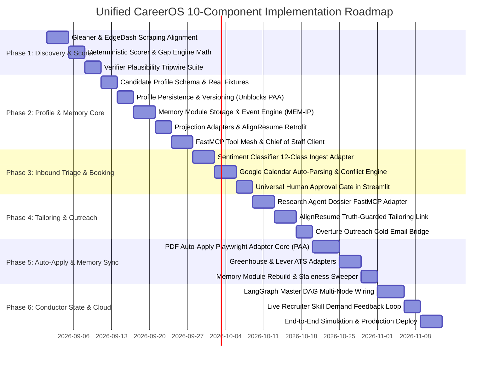

# UNIFIED CAREEROS: PHASE-WISE IMPLEMENTATION PLAN
## Master Roadmap, Execution Timeline, Deliverables, and Verification Gates

**Document ID:** CAREEROS-IMPL-v2.2  
**Status:** Approved Implementation Schedule  
**Timeline:** 8-Week Phased Rollout across 6 Engineering Phases

---

## 1. Master Implementation Roadmap

---

## 2. Phase-by-Phase Technical Deliverables

### Phase 1: Core Discovery, Scraping & Deterministic Scoring Engine (Weeks 1–2)
* **Subsystems Involved:** `The Gleaner [1]`, `EdgeDash Core Engine`
* **Key Tasks:**
  1. Consolidate scrapers (LinkedIn, Indeed, RemoteOK, Arbeitnow) behind unified normalized schema.
  2. Implement stable hash deduplication (`INSERT OR IGNORE` on `SHA256(source + url)`).
  3. Author deterministic 4-part scoring math in `scoring.py` with 100% unit test coverage.
  4. Deploy Verifier agent with 4 plausibility checks (spread $\ge 10$, volume bounds, gap consistency).
* **Exit Criteria:** 50+ real live listings ingested; dedup verified on run 2; score spread $\ge 15$.
* **Badges:** The Tracker & The Decoder.

---

### Phase 2: Candidate Profile Anchor, Memory Module Core & FastMCP Mesh (Weeks 2–3)
* **Subsystems Involved:** `Candidate Profile [10]`, `Memory Module [8]`, `EdgeDash MCP Server`, `Synapse-AI [9]`
* **Key Tasks:**
  1. **Candidate Profile Core (Phase 0):** Implement all Pydantic v2 schemas (`CandidateProfile`, `Identity`, `SkillRecord`, `ExperienceRecord`, `SourceProvenance`). Validate against candidate's actual resume data with zero manual patching.
  2. **Persistence & Versioning (Phase 1):** Build atomic `get`/`put` temp-file-and-rename persistence engine with `schema_version` migration chain. **Formally resolves Usher (PDF Auto-Apply) Phase 0 and Gleaner Phase 0 schema blockers.**
  3. **Projection Adapters (Phase 2):** Implement `to_resume_profile()`, `to_search_criteria()`, `to_outreach_context()`, and `to_application_view()`. Retrofit AlignResume to consume canonical projection.
  4. **Ownership Guard & Reducer (Phase 3):** Implement LangGraph-compatible `merge_candidate_profile()` state reducer enforcing single-writer rules and append-only history refs (`tailoring_history`, `outreach_history`, `application_history`, `interaction_signals`).
  5. **Memory Module Engine:** Build `MemoryStore` with SQLite WAL mode, deterministic state transitions, 30-day domain cooldowns, and `rebuild_derived_state()` (ADR-4).
  6. **FastMCP Server Mesh:** Deploy FastMCP tools across Candidate Profile, EdgeDash, and Memory Module; connect Chief of Staff as client.
* **Exit Criteria:** Candidate Profile validates real candidate data (HG-1); atomic persistence verified (HG-3); Memory Module records events and rebuilds state with 100% determinism (G5); all FastMCP tools return valid JSON in $< 50$ms.

---

### Phase 3: Inbound Recruiter Triage, Calendar Hub & Approval Gate (Week 4)
* **Subsystems Involved:** `MCP Chief of Staff [6]`, `Sentiment Classifier [9]`, `Google Calendar Engine`
* **Key Tasks:**
  1. Map Sentiment Classifier 12-class intents to Chief of Staff priorities (`URGENT`, `NEEDS_REPLY`, `FYI`, `IGNORE`).
  2. Emit `RESPONSE_CLASSIFIED` event to Memory Module and append reference to `profile.interaction_signals`.
  3. Wire `interview_invite` intent directly to `calendar_engine.py` for conflict checking.
  4. Deploy central Streamlit Approval Gate for physical user review of outbound actions.
* **Exit Criteria:** Inbound interview email triggers automated slot checking, draft staging, and Memory record update; 0 unapproved sends.
* **Badge:** The Automator.

---

### Phase 4: Research Dossiers, Resume Tailoring & Cold Outreach (Week 5)
* **Subsystems Involved:** `Research Agent [4]`, `AlignResume [2]`, `Overture Outreach [3]`
* **Key Tasks:**
  1. Wrap Research Agent behind `generate_company_dossier` FastMCP tool, reading candidate industry preferences.
  2. Connect AlignResume API consuming `to_resume_profile(profile)`; enforce anti-fabrication gates against `SourceProvenance.verified`; generate `ResumeArtifact` and emit `RESUME_TAILORED`.
  3. Pipe Overture cold email generator output into the Approval Gate queue and emit `OUTREACH_SENT`.
* **Exit Criteria:** High-fit job ($\ge 80$) auto-generates company brief, tailored PDF, and staged cold email with full event audit in Memory.

---

### Phase 5: PDF Auto-Apply Agent ("Usher") & Memory Synchronization (Weeks 6–7)
* **Subsystems Involved:** `PDF Auto-Apply Agent [7]`, `Memory Module [8]`, `Candidate Profile [10]`
* **Key Tasks:**
  1. Build Playwright-based `BaseATSAdapter` for Greenhouse and Lever, consuming `to_application_view(profile)`.
  2. Implement 4-tier field resolution ladder (Selector $\rightarrow$ Fuzzy $\rightarrow$ LLM light $\rightarrow$ LLM heavy).
  3. Enforce **DRAFT** mode as default; render filled form previews in the Approval Gate.
  4. Query `check_domain_cooldown(domain)` before launching browser; emit `APPLICATION_SUBMITTED` upon submission.
  5. Implement `get_stale_applications()` sweeper to infer `GHOSTED` status after $N$ silent days.
* **Exit Criteria:** PDF Auto-Apply fills 100% of standard ATS fields; forms held in DRAFT mode; cooldowns prevent re-applications within 30 days.
* **Badge:** The Usher.

---

### Phase 6: Conductor Master LangGraph DAG & Production Deployment (Weeks 7–8)
* **Subsystems Involved:** `Conductor Agent [0]`, `All Subsystems`
* **Key Tasks:**
  1. Implement central LangGraph DAG coordinating all 9 sub-agents under `AgentAdapter` using `CandidateProfile` as shared state.
  2. Connect Conductor queries directly to `MemoryStore` (`get_application`, `list_applications`, `get_history`).
  3. Stream live recruiter technical keywords from email triage into EdgeDash Gap Analyzer.
  4. Configure automated daily GitHub Actions scheduler and deploy public read-only dashboard to Hugging Face Spaces.
  5. Execute end-to-end multi-agent simulation suite (100 opportunities).
* **Exit Criteria:** 100/100 simulated opportunities processed through full lifecycle; daily cron runs unattended.
* **Badges:** The Edge & The Conductor (Complete Certification).
