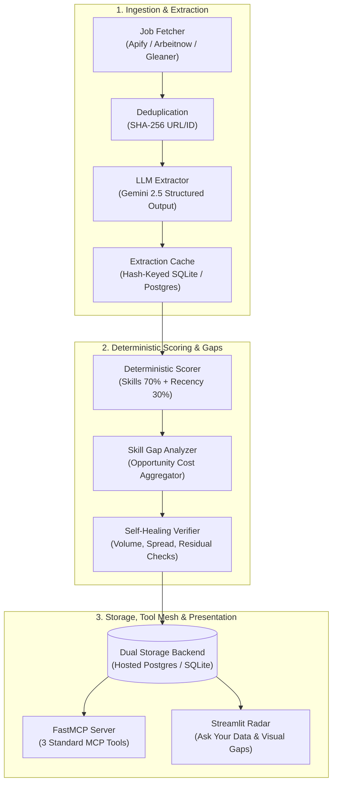

# 🧭 CareerHelm — Autonomous Career Radar & Opportunity Engine

[](https://www.python.org/)
[](https://github.com/jlowin/fastmcp)
[](https://streamlit.io/)
[-orange.svg)](.github/workflows/cycle.yml)
[](tests/)

**CareerHelm** is the autonomous market intelligence, discovery, and opportunity cost engine for the **CareerOS Platform**. It continuously monitors labor market feeds, extracts structured requirements with schema-gated LLMs, deterministically scores alignment against verified candidate profiles, analyzes high-impact skill gaps, and serves real-time insights via FastMCP and an interactive Streamlit radar dashboard.

---

## 🏗️ Architecture & Subsystem Topology



---

## ⚡ Key Features

1. **Dual Storage Architecture (Hosted Postgres & Local SQLite):**
   - Automatically switches between hosted PostgreSQL (Supabase / Neon via `DATABASE_URL`) and local SQLite for offline development.
   - Dynamic query dialect translation (`?` vs `%s`, `INSERT OR IGNORE` vs `ON CONFLICT DO NOTHING`).
   - Schema management via `python -m edgedash.storage --migrate` and `python -m edgedash.storage --check`.

2. **Deterministic Scorer (Zero LLM in Critical Path):**
   - Pure, mathematical scoring:
     $$\text{Score} = (\text{Skill Match} \times 0.70) + (\text{Recency Decay} \times 0.30)$$
   - Zero LLM variability in fit calculation; produces stable, auditable scores in $[0, 100]$.

3. **Opportunity Cost Skill Gap Analyzer:**
   - Computes lost opportunity value for missing skills across all scanned market listings:
     $$\text{Opportunity Cost}(s) = \sum_{j \in \text{Blocked}(s)} \frac{\text{Fit Score}(j)}{100}$$

4. **Self-Healing Loop & Health Reporter:**
   - Evaluates system invariants with `python -m edgedash.health`:
     - Database reachability & responsiveness
     - Listing freshness ($\le 3.0$ days)
     - Cycle execution cadence ($\le 48.0$ hours)
     - Plausibility verification stability

5. **FastMCP Tool Mesh Integration:**
   - Exposes three high-level tools over standard Model Context Protocol:
     - `run_discovery_cycle`: Triggers an autonomous market loop cycle.
     - `get_market_insights`: Returns best job matches and top skill gaps.
     - `query_market_data`: Natural language Q&A over market listings and employers.

6. **Interactive Streamlit Radar Dashboard (`app.py`):**
   - Real-time market metrics and live health indicator.
   - Natural language *"Ask Your Data"* interface.
   - Interactive Opportunity Cost bar charts and job matches table.
   - Sub-agent execution logs and Verifier audit trails.

---

## 🚀 Quickstart & Usage

### 1. Installation

```bash
git clone https://github.com/sdn9300/careerhelm.git
cd careerhelm
pip install -r requirements.txt
```

### 2. Database Setup & Migration

```bash
# Verify connection status
python -m edgedash.storage --check

# Run schema migrations
python -m edgedash.storage --migrate
```

### 3. Run Autonomous Market Cycle

```bash
# Run full cycle with real or mock data
python run_cycle.py --mock

# Inspect system health report
python -m edgedash.health
```

### 4. Launch Streamlit Radar

```bash
streamlit run app.py
```

### 5. Start FastMCP Server

```bash
python -m edgedash.mcp_server
```

---

## 🧪 Automated Test Suite

Run the full pytest suite:

```bash
pytest -v
```

```
tests/test_checks.py ......................... PASSED
tests/test_config.py ......................... PASSED
tests/test_mcp.py ............................ PASSED
tests/test_orchestrator.py ................... PASSED
tests/test_planning.py ....................... PASSED
tests/test_scoring.py ........................ PASSED
tests/test_skills.py ......................... PASSED
tests/test_storage.py ........................ PASSED
tests/test_tools.py .......................... PASSED

====================== 26 passed in 3.98s ======================
```

---

## 📜 CareerOS Ecosystem Integration

CareerHelm functions as **Subsystem #1** within the 13-subsystem **CareerOS Platform**:
- **Conductor Agent (`sdn9300/conductor-agent`):** Sole lifecycle coordinator.
- **Candidate Profile (`sdn9300/conductor-candidate-profile`):** Verified identity and skill authority.
- **Memory Module (`sdn9300/conductor-memory-module`):** Immutable event-sourced ledger.
- **Chief of Staff (`sdn9300/mcp-chief-of-staff`):** Recruiter inbox triage and calendar hub.
- **Gleaner (`sdn9300/gleaner-job-scout`):** Multi-board scraper.

---

## 📄 License

MIT License. Engineered for autonomous career trajectory navigation.
