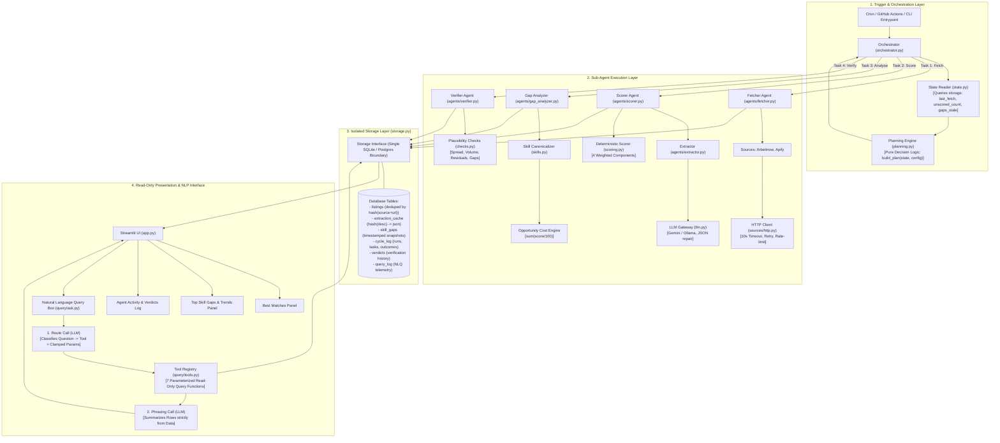

# EDGEDASH CORE ENGINE: DETAILED ARCHITECTURE DESIGN
## Comprehensive System Topology, Mathematical Formulations, Subsystem Deep Dives, and Data Schemas

**Document ID:** EDGEDASH-CORE-ARCH-v1.0  
**Status:** Approved Technical Architecture  
**Scope:** EdgeDash Autonomous Scheduled Loop & Core Subsystems

---

## 1. System Topology & Architectural Overview

EdgeDash is organized into a modular, unidirectional execution topology with strict boundary isolation:



---

## 2. Core Subsystem Deep Dives

### Subsystem 1: Configuration & Environment (`edgedash/config.py`)
* **Dataclass `Config`:** Holds `target_role`, `target_city`, `keywords`, `my_skills`, `experience_years`, `weights`, `score_batch_size`, `fetch_interval_hours`, `llm_provider`, `llm_model`, `skill_aliases`.
* **Validation:** Fails fast if `config.yaml` is absent or malformed. CLI check: `python -m edgedash.config`.

### Subsystem 2: Isolated Storage Layer (`edgedash/storage.py`)
* Sole module permitted to import `sqlite3` or database drivers (Rule 2).
* **Database Schemas:**
  ```sql
  CREATE TABLE IF NOT EXISTS listings (
      id TEXT PRIMARY KEY,           -- Stable SHA256 of source + url
      title TEXT NOT NULL,
      company TEXT NOT NULL,
      location TEXT,
      url TEXT NOT NULL,
      description TEXT NOT NULL,
      source TEXT NOT NULL,
      posted_at TEXT,
      fetched_at TEXT NOT NULL,
      fit_score INTEGER NULL,
      fit_reason TEXT NULL,
      components TEXT NULL,          -- JSON string of component scores
      scored_at TEXT NULL
  );

  CREATE TABLE IF NOT EXISTS extraction_cache (
      desc_hash TEXT PRIMARY KEY,    -- SHA256 of raw description text
      extracted_json TEXT NOT NULL,
      created_at TEXT NOT NULL
  );

  CREATE TABLE IF NOT EXISTS skill_gaps (
      id INTEGER PRIMARY KEY AUTOINCREMENT,
      snapshot_id TEXT NOT NULL,
      computed_at TEXT NOT NULL,
      skill TEXT NOT NULL,
      listings_blocked INTEGER NOT NULL,
      opportunity_cost REAL NOT NULL,
      mean_score REAL NOT NULL,
      top_score INTEGER NOT NULL,
      example_ids TEXT NOT NULL,     -- Comma-separated listing IDs
      also_nice_to_have INTEGER NOT NULL
  );

  CREATE TABLE IF NOT EXISTS cycle_log (
      id INTEGER PRIMARY KEY AUTOINCREMENT,
      cycle_id TEXT NOT NULL,
      agent TEXT NOT NULL,
      started_at TEXT NOT NULL,
      finished_at TEXT NOT NULL,
      records_touched INTEGER NOT NULL,
      status TEXT NOT NULL,          -- ok | failed | partial | nothing_to_do
      notes TEXT
  );

  CREATE TABLE IF NOT EXISTS verdicts (
      id INTEGER PRIMARY KEY AUTOINCREMENT,
      cycle_id TEXT NOT NULL,
      checked_at TEXT NOT NULL,
      verdict TEXT NOT NULL,         -- pass | fail
      failed_check TEXT,
      observed_value REAL,
      threshold REAL,
      action_taken TEXT
  );

  CREATE TABLE IF NOT EXISTS query_log (
      id INTEGER PRIMARY KEY AUTOINCREMENT,
      question TEXT NOT NULL,
      tool_used TEXT,
      params TEXT,
      status TEXT NOT NULL,          -- answered | refused | rate_limited
      duration_ms INTEGER NOT NULL,
      created_at TEXT NOT NULL
  );
  ```

### Subsystem 3: Source Layer & Fetcher (`sources/` & `agents/fetcher.py`)
* **Plugin Architecture:** Sources register via `@register` decorator into `SOURCES` registry.
* **HTTP Helper (`http.py`):** Centralized `get_json()` with 10s timeout, exponential backoff (2 retries), User-Agent header, and rate-limiting (1 req/sec).
* **Fault Isolation (Rule 12):** Per-source `try/except` boundary. Failing sources log `failed` to `cycle_log` while allowing other sources to write.
* **Deduplication:** Uses `INSERT OR IGNORE` on `hash(source + url)`. `upsert_listings()` returns genuinely new rows inserted.

### Subsystem 4: LLM Gateway & Fact Extractor (`llm.py` & `agents/extractor.py`)
* **Single Door (`llm.py`):** `complete_json(prompt, schema)` strips markdown code fences, validates against schema, and performs smart retry with error feedback.
* **Extractor (`extractor.py`):** Extracts facts without candidate context:
  ```json
  {
    "required_skills": ["python", "fastapi", "kubernetes"],
    "nice_to_have": ["docker", "gcp"],
    "seniority": "mid",
    "years_required": 3,
    "remote_ok": true
  }
  ```
* **Description-Hash Caching:** Caches extraction output against `SHA256(description)`.

### Subsystem 5: Deterministic Scoring Engine (`scoring.py` & `agents/scorer.py`)
* **Pure Arithmetic Formula:**
  $$\text{Score} = 100 \times \left( w_1 \cdot S_{\text{skill}} + w_2 \cdot S_{\text{seniority}} + w_3 \cdot S_{\text{location}} + w_4 \cdot S_{\text{recency}} \right)$$
  Where default weights are: $w_1 = 0.45$, $w_2 = 0.25$, $w_3 = 0.15$, $w_4 = 0.15$.
  * $S_{\text{skill}} = \frac{|\text{matched\_required}| + \frac{1}{3}|\text{matched\_nice}|}{|\text{required\_skills}| + \frac{1}{3}|\text{nice\_to\_have}|}$
  * $S_{\text{seniority}}$: Exact match ($1.0$), 1 band away ($0.6$), 2 bands ($0.25$), $3+$ bands ($0.0$).
  * $S_{\text{location}}$: Remote or target city ($1.0$), unknown ($0.5$), non-remote mismatch ($0.1$).
  * $S_{\text{recency}}$: Linear decay from 1.0 (0 days) to 0.0 (30 days); null posted date defaults to 0.5.
* **Formulaic Reason Generator:** Assembled directly from numbers:
  `"4/6 required skills · seniority fits · remote · posted 2d ago · gap: kubernetes, spark"`

### Subsystem 6: Canonicalisation & Gap Analyzer (`skills.py` & `agents/gap_analyzer.py`)
* **Canonicalisation (`canonical()`):** Lowercase, strip punctuation, remove parenthetical qualifiers (`kubernetes (eks)` $\rightarrow$ `kubernetes`), collapse internal whitespace, and apply `skill_aliases`.
* **Weighted Opportunity Cost (Rule 24):**
  $$\text{Opportunity Cost}(k) = \sum_{j \in \text{Blocked}(k)} \frac{\text{Fit Score}(j)}{100}$$
* **Drillability & Snapshots:** Appends snapshot record with top 5 listing IDs. Flags sample sizes $< 3$ as "low confidence".

### Subsystem 7: State-Driven Orchestrator (`state.py`, `planning.py`, `orchestrator.py`)
* **`read_state(config, now)`:** Evaluates `hours_since_fetch`, `unscored_count`, `gaps_stale`, `last_cycle_verdict`.
* **`build_plan(state, config)`:** Pure function returning ordered `Task` objects with caller-enforced stop conditions (`max_items`, `max_seconds`, `max_pages`).
* **Exit Semantics:** If plan contains only skips, logs `nothing_to_do` and exits 0 cleanly in $< 50$ms.

### Subsystem 8: Verifier Subsystem (`checks.py` & `agents/verifier.py`)
* **4 Plausibility Checks:**
  1. *Score Spread Check:* Asserts $\max(\text{score}) - \min(\text{score}) \ge 10$.
  2. *Unscored Residual Check:* Asserts unscored listings decreased by batch size.
  3. *Volume Stability Check:* Detects sudden drops in scraper output.
  4. *Gap Consistency Check:* Reconciles top gaps with underlying listings.
* **Self-Healing:** 1 capped retry with stricter extraction rubric; if still failing, marks cycle `Degraded` (*"Stale beats wrong"*).

### Subsystem 9: Safe NLP Query Interface (`query/tools.py` & `query/ask.py`)
* **Zero Text-to-SQL (Rule 40):** 7 pre-written tools (`companies_hiring`, `best_matches`, `top_gaps`, `gap_detail`, `trend`, `listing_count`, `skill_demand`).
* **Two-Stage Architecture:**
  1. *Route:* LLM classifies prompt to tool and extracts clamped arguments.
  2. *Phrase:* LLM summarizes returned rows using only figures present in the data.
* **Abuse Guards:** Session rate limit (10 queries / 10 min), daily ceiling (200/day), injection string filtering.

### Subsystem 10: Streamlit Dashboard (`app.py`)
* Decoupled read-only presentation reading from the latest verified passing cycle.
* 3 Panels: Best Matches, Top Skill Gaps & Trends, and Agent Activity Log.
