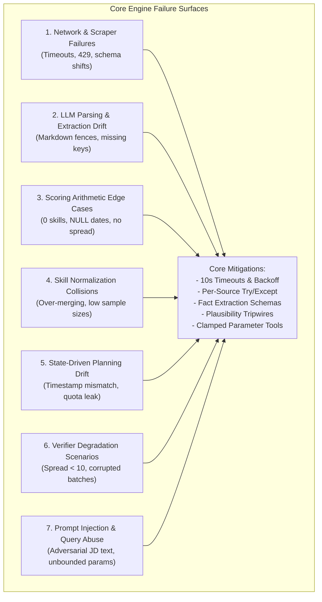
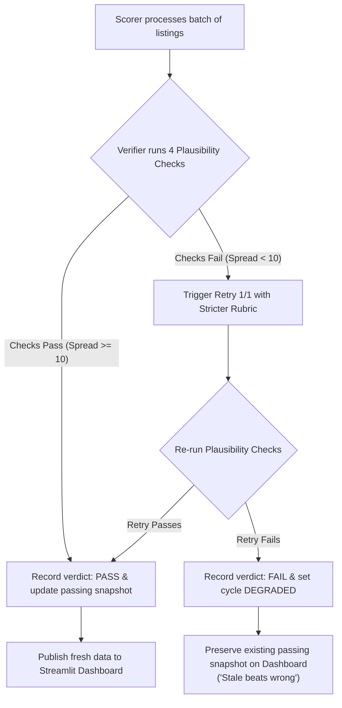

# EDGEDASH CORE ENGINE: COMPREHENSIVE EDGE CASES PLAN
## Failure Domain Taxonomy, Root Cause Analyses, Architectural Mitigations, and Recovery Protocols

**Document ID:** EDGEDASH-CORE-EDGE-v1.0  
**Status:** Approved Fault Tolerance Specification  
**Scope:** EdgeDash Core Engine Failure Surfaces, Self-Healing, and Degradation Protocols

---

## 1. Core Engine Failure Taxonomy



---

## 2. Comprehensive Edge Case Mitigation Matrix

```
+----------------------------------------------------------------------------------------------------------------------------------+
|                                              CORE ENGINE MASTER EDGE CASE MATRIX                                                 |
+-------------------+-----------------------------+------------------------------------+-------------------------------------------+
| Failure Domain    | Scenario                    | Root Cause                         | Architectural Mitigation & Recovery       |
+-------------------+-----------------------------+------------------------------------+-------------------------------------------+
| Network & Scraper | Connection hangs indefinitely| Dropped socket / server unresp.    | http.py helper enforces 10s timeout;      |
|                   | on scheduled runner         |                                    | 2 retries with exponential backoff.       |
+-------------------+-----------------------------+------------------------------------+-------------------------------------------+
| Network & Scraper | Single job board returns    | Rate limiting or server error      | Per-source try/except in fetcher.py;      |
|                   | 500 / 429 / 404             | on external service                | logs status="failed", other sources run.  |
+-------------------+-----------------------------+------------------------------------+-------------------------------------------+
| Network & Scraper | 0 listings survive strict   | Overly narrow keyword or city      | ArbeitnowSource progressive relaxation:   |
|                   | location/keyword filters    | setting in config.yaml             | relaxes city filter first, logs event.    |
+-------------------+-----------------------------+------------------------------------+-------------------------------------------+
| LLM & Extraction  | Model returns markdown code | Conversational LLM fine-tune       | complete_json() strips markdown backticks |
|                   | fences (```json ... ```)    | chat defaults                      | and regex-extracts outer JSON object.     |
+-------------------+-----------------------------+------------------------------------+-------------------------------------------+
| LLM & Extraction  | Schema validation fails     | Model omits required key           | Retries ONCE feeding exact validation     |
|                   | (e.g. required_skills key)  | from JSON response                 | error. If fail, drop single row.          |
+-------------------+-----------------------------+------------------------------------+-------------------------------------------+
| LLM & Extraction  | Repeated scoring runs burn  | Re-scoring already scored rows     | Description-hash caching in storage.py;   |
|                   | API quota and budget        | without caching                    | query filter: WHERE fit_score IS NULL.    |
+-------------------+-----------------------------+------------------------------------+-------------------------------------------+
| Scoring Math      | Job description lists 0     | Vague or unformatted job posting   | scoring.py handles empty array explicitly;|
|                   | required skills             | text                               | returns 0.0 without ZeroDivisionError.    |
+-------------------+-----------------------------+------------------------------------+-------------------------------------------+
| Scoring Math      | posted_at timestamp is NULL | Missing date metadata from scraper | Recency component defaults safely to 0.5; |
|                   | or unparseable              |                                    | zero exceptions thrown.                   |
+-------------------+-----------------------------+------------------------------------+-------------------------------------------+
| Scoring Math      | All scores cluster in 80s   | Candidate skill list in config     | Scorer logs distribution; Verifier flags  |
|                   | (no discriminability)       | is overly broad                    | spread < 10 as suspect and fails cycle.   |
+-------------------+-----------------------------+------------------------------------+-------------------------------------------+
| Skill Aggregation | Fragmentation of skill names| Varied phrasing across 200 JDs     | canonical() strips punctuation/qualifiers;|
|                   | (k8s vs Kubernetes)         | (e.g. "Kubernetes (EKS)")          | maps aliases from explicit config map.    |
+-------------------+-----------------------------+------------------------------------+-------------------------------------------+
| Skill Aggregation | Over-merging of distinct    | Automated fuzzy clustering         | Rule 23 forbids auto-merging; --suggest   |
|                   | skills (Node into JS)       | without human review               | outputs YAML for human review only.       |
+-------------------+-----------------------------+------------------------------------+-------------------------------------------+
| Skill Aggregation | Low-sample gap dominating   | Niche skill in 1 high-scoring job  | Rule 27: gaps computed from < 3 listings  |
|                   | top rankings                |                                    | are flagged as "low confidence".          |
+-------------------+-----------------------------+------------------------------------+-------------------------------------------+
| State & Planning  | Cycle runs every agent      | State reader queries stale or      | build_plan() compares hours_since_fetch;  |
|                   | even when nothing changed   | logic ignores thresholds           | outputs nothing_to_do and exits 0 cleanly.|
+-------------------+-----------------------------+------------------------------------+-------------------------------------------+
| State & Planning  | Sub-agent ignores limits    | Agent uses internal default        | Orchestrator sets stop conditions; agent  |
|                   | (scores 100 instead of 25)  | instead of Task parameter          | reads Task.stop_conditions explicitly.    |
+-------------------+-----------------------------+------------------------------------+-------------------------------------------+
| Verifier Subsystem| Silent extraction drift     | Model prompt drift misses key      | Verifier spread check fails; retries 1x   |
|                   | across 40 listings          | skill across whole batch           | with stricter rubric; marks Degraded.     |
+-------------------+-----------------------------+------------------------------------+-------------------------------------------+
| Verifier Subsystem| Corrupted data published    | Bad batch overwrites valid data    | Rule 38: Dashboard reads ONLY last passing|
|                   | to public dashboard         | in database                        | cycle snapshot ("Stale beats wrong").     |
+-------------------+-----------------------------+------------------------------------+-------------------------------------------+
| Security & Query  | Prompt injection in scraped | Adversarial instructions hidden in | Rule 40: Zero Text-to-SQL; model only     |
|                   | job description             | public job posting text            | selects from 7 pre-written query tools.   |
+-------------------+-----------------------------+------------------------------------+-------------------------------------------+
| Security & Query  | Model passes absurd bounds  | Model parameter hallucination      | Parameter validation clamps integers      |
|                   | (e.g. days: 99999)          |                                    | (days 1-90, n 1-25) before DB query.      |
+-------------------+-----------------------------+------------------------------------+-------------------------------------------+
| Security & Query  | Out-of-scope question asked | User asks career advice            | Rule 45: returns static refusal listing   |
|                   | in Ask box                  |                                    | supported questions; makes 0 DB calls.    |
+-------------------+-----------------------------+------------------------------------+-------------------------------------------+
| Public UI Abuse   | Public URL flooded with bot | Publicly exposed text input box    | Session rate limiting (10 queries/10 min);|
|                   | queries                     | on Streamlit dashboard             | daily cap (200/day) disables Ask box only.|
+-------------------+-----------------------------+------------------------------------+-------------------------------------------+
```

---

## 3. Deep Recovery Protocols

### Protocol 1: The "Stale Beats Wrong" Verifier Degradation Protocol


### Protocol 2: The Two-Call Safe NLP Routing & Execution Protocol
1. **User Prompt Ingestion:** User inputs: `Which companies posted remote roles this week?`
2. **Routing Call (LLM 1):** The model receives tool descriptions and the question. Output:
   ```json
   { "tool": "companies_hiring", "params": { "days": 7 }, "confidence": "high" }
   ```
3. **Parameter Clamping Layer:** Python clamps `days = max(1, min(7, 90))`.
4. **Deterministic DB Query:** Pre-written SQL function `companies_hiring(days=7)` executes via `storage.py`. Returns 12 rows.
5. **Phrasing Call (LLM 2):** The model receives returned rows and is instructed to summarize using *only* numbers present in the data.
6. **Display:** The Streamlit dashboard renders the prose summary and the raw database table directly underneath.
