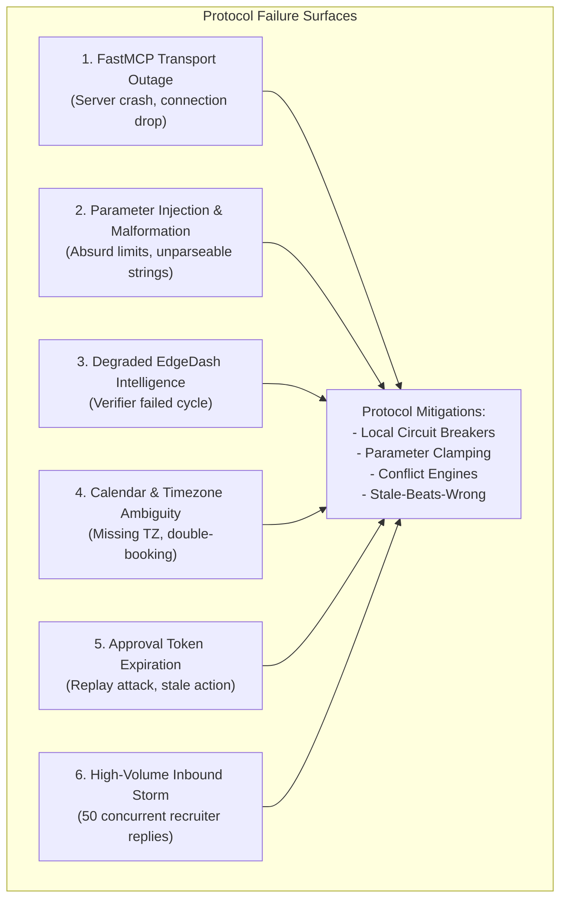
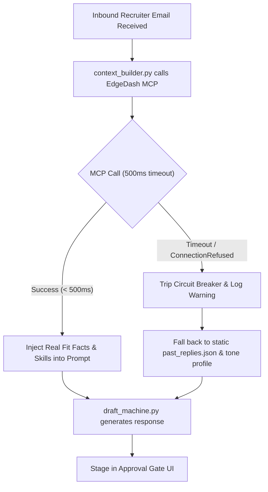

# EDGEDASH ↔ MCP CHIEF OF STAFF: PROTOCOL EDGE CASES PLAN
## Failure Scenarios, Protocol Breakdowns, Root Cause Analyses, and Recovery Procedures

**Document ID:** PROTOCOL-EDGE-v1.0  
**Status:** Approved Fault Tolerance Specification  
**Scope:** FastMCP Protocol Boundaries, Asynchronous Synchronization, and Security Guardrails

---

## 1. Protocol Failure Domains



---

## 2. Protocol Edge Case Mitigation Matrix

```
+----------------------------------------------------------------------------------------------------------------------------------+
|                                              PROTOCOL MASTER EDGE CASE MATRIX                                                    |
+-------------------+-----------------------------+------------------------------------+-------------------------------------------+
| Failure Category  | Scenario                    | Root Cause                         | Protocol Mitigation & Recovery Protocol   |
+-------------------+-----------------------------+------------------------------------+-------------------------------------------+
| MCP Transport     | EdgeDash FastMCP server is  | Process terminated or scheduled    | context_builder.py trips circuit breaker; |
|                   | offline / unreachable       | loop restart in progress           | falls back to static past_replies.json.   |
+-------------------+-----------------------------+------------------------------------+-------------------------------------------+
| MCP Transport     | Protocol call hangs         | Slow SQLite query or deadlock in   | Client enforces 500ms timeout; aborts call|
|                   | (latency > 500ms)           | EdgeDash process                   | and proceeds with local persona defaults. |
+-------------------+-----------------------------+------------------------------------+-------------------------------------------+
| Parameter Safety  | Model passes absurd limit   | Stochastic LLM argument            | FastMCP tool clamps integers to safe range|
|                   | (e.g. limit: 50000)         | hallucination                      | (limit in [1, 25], days in [1, 90]).      |
+-------------------+-----------------------------+------------------------------------+-------------------------------------------+
| Parameter Safety  | Model passes unformatted    | Recruiter typo or informal         | canonical() normalizes string; unresolved |
|                   | raw skill ("K8s (EKS)")     | phrasing in email body             | terms return empty list without crashing. |
+-------------------+-----------------------------+------------------------------------+-------------------------------------------+
| State Sync        | EdgeDash Verifier flagged   | Extraction drift or score spread   | Protocol reads ONLY from the last passing |
|                   | current cycle as Degraded   | failure in latest loop             | cycle snapshot ("Stale beats wrong").     |
+-------------------+-----------------------------+------------------------------------+-------------------------------------------+
| Calendar Engine   | Recruiter states "2 PM"     | Recruiter omitted explicit timezone| calendar_engine.py defaults to candidate  |
|                   | with no timezone specified  | metadata                           | local timezone; explicitly states TZ in draft.|
+-------------------+-----------------------------+------------------------------------+-------------------------------------------+
| Calendar Engine   | Recruiter proposes an       | Overlapping event already on       | calendar_engine flags CONFLICT_DETECTED;  |
|                   | already-booked slot         | candidate Google Calendar          | auto-generates 3 open alternative slots.  |
+-------------------+-----------------------------+------------------------------------+-------------------------------------------+
| Approval Gate     | User approves stale draft   | Email received 5 days ago; slot    | Approval Gate re-verifies calendar slot   |
|                   | after long delay            | may no longer be available         | availability before final API dispatch.   |
+-------------------+-----------------------------+------------------------------------+-------------------------------------------+
| Approval Gate     | Replay attack or repeated   | Accidental double-click on UI      | Single-use cryptographic approval token;  |
|                   | submission on send button   | button in Streamlit                | token is invalidated immediately on send. |
+-------------------+-----------------------------+------------------------------------+-------------------------------------------+
| Inbound Telemetry | Recruiter email contains    | Adversarial or promotional spam    | Regex taxonomy whitelist; unrecognized    |
|                   | 100+ random buzzwords       | email body                         | strings discarded before telemetry stream.|
+-------------------+-----------------------------+------------------------------------+-------------------------------------------+
```

---

## 3. Deep Recovery Protocol Walkthroughs

### Protocol 1: The MCP Transport Circuit Breaker Protocol


### Protocol 2: The "Stale Beats Wrong" State Resolution Protocol
1. **Trigger Condition:** Chief of Staff calls `get_best_job_matches(company="Stripe")`.
2. **State Inspection:** The EdgeDash MCP server inspects `verdicts` table for the latest `cycle_id`.
3. **Verdict Evaluation:**
   - If latest verdict is `PASS`: query executes against current `listings` table.
   - If latest verdict is `FAIL` / `DEGRADED`: query automatically resolves against the latest cycle tagged with `status = "PASS"`.
4. **Safety Guarantee:** Unverified, potentially corrupted intelligence never reaches recruiter-facing email drafts.

### Protocol 3: The Single-Use Approval Token Protocol
1. **Draft Staging:** When a draft and calendar event are staged, `approval_gate.py` issues a cryptographically random UUID (`action_token_98f2a1`).
2. **Token Binding:** The token is bound in memory to the exact `{thread_id, draft_body, slot_iso}` tuple.
3. **User Action:** The user clicks **"Approve & Send"** in the Streamlit UI.
4. **Token Consumption:** The backend receives the token, validates its existence, executes the Gmail send / Calendar book API, and **immediately deletes the token**.
5. **Replay Rejection:** Any repeated click or duplicate HTTP request with the same token is rejected with `409 Conflict: Action already executed`.
