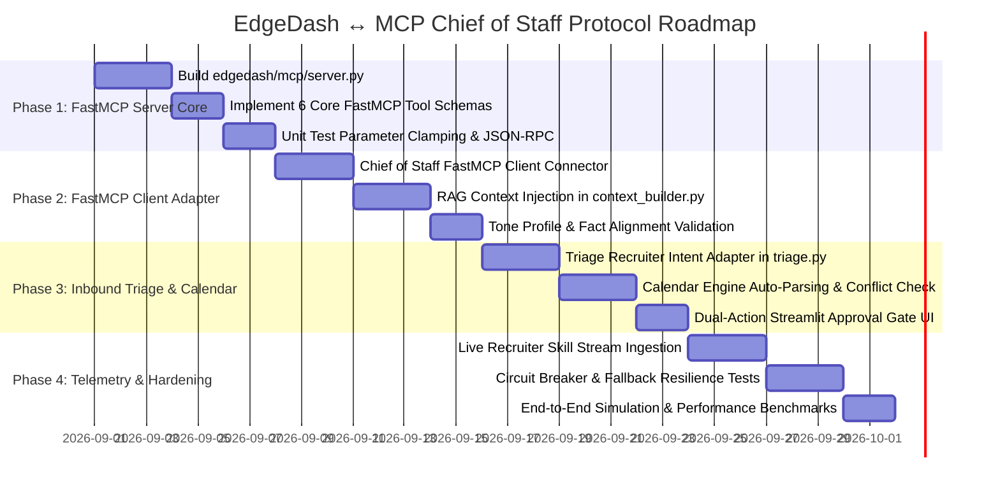

# EDGEDASH ↔ MCP CHIEF OF STAFF: PHASE-WISE IMPLEMENTATION PLAN
## Master Protocol Roadmap, Implementation Phases, Deliverables, and Verification Milestones

**Document ID:** PROTOCOL-IMPL-v1.0  
**Status:** Approved Implementation Schedule  
**Timeline:** 4-Week Phased Integration Plan

---

## 1. Protocol Implementation Gantt Roadmap

---

## 2. Phase-by-Phase Technical Deliverables

### Phase 1: FastMCP Server Core in EdgeDash (Week 1)

#### Objectives
* Construct the dedicated FastMCP server inside EdgeDash exposing the 6 read-only tools.
* Enforce strict input validation, integer clamping, and canonical skill resolution.

#### Modules & Files
* `edgedash/mcp/__init__.py`
* `edgedash/mcp/server.py`
* `tests/test_mcp_server.py`

#### Tasks
1. [ ] Install and configure `FastMCP` (`mcp` library).
2. [ ] Wrap EdgeDash storage queries inside `@mcp.tool()` decorators for:
   - `get_best_job_matches`
   - `get_skill_gap_analysis`
   - `get_skill_drilldown`
   - `check_company_hiring_status`
   - `get_market_skill_demand`
   - `get_system_status`
3. [ ] Implement parameter clampers in `edgedash/mcp/server.py`.
4. [ ] Write unit tests verifying that all tools return valid JSON payloads and respect boundaries.

#### Phase 1 Exit Criteria
* `python -m edgedash.mcp.server --check` starts server cleanly.
* `pytest tests/test_mcp_server.py` passes 100% of clamping and schema tests.

---

### Phase 2: Chief of Staff FastMCP Client & Context RAG (Week 2)

#### Objectives
* Build the asynchronous FastMCP client inside Chief of Staff.
* Connect `context_builder.py` to dynamically retrieve company match data and skill profiles.

#### Modules & Files
* `mcp_chief_of_staff/mcp_client.py`
* `mcp_chief_of_staff/context_builder.py`
* `mcp_chief_of_staff/draft_machine.py`
* `tests/test_context_builder.py`

#### Tasks
1. [ ] Build `MCPClientAdapter` in `mcp_client.py` supporting STDIO/SSE transport.
2. [ ] Update `context_builder.py` to extract sender company domain, query `check_company_hiring_status` and `get_best_job_matches`.
3. [ ] Inject retrieved job facts (matched skills, fit reasons) into draft prompt templates in `draft_machine.py`.
4. [ ] Implement local fallback: if MCP client raises timeout/connection error, fallback to static `past_replies.json`.

#### Phase 2 Exit Criteria
* Drafted replies to recruiter emails reference actual matched skills and fit scores.
* Unreachable MCP server triggers graceful fallback with 0 application crashes.

---

### Phase 3: Recruiter Triage Mapping, Calendar Staging & Approval Gate (Week 3)

#### Objectives
* Map Sentiment Classifier 12-class recruiter intents to Chief of Staff priorities.
* Automate Google Calendar conflict checking upon receiving `interview_invite` intents.
* Build the dual-panel review screen in the Streamlit Approval Gate.

#### Modules & Files
* `mcp_chief_of_staff/triage.py`
* `mcp_chief_of_staff/calendar_engine.py`
* `mcp_chief_of_staff/approval_gate.py`
* `mcp_chief_of_staff/app.py`
* `tests/test_recruiter_loop.py`

#### Tasks
1. [ ] Update `triage.py` to route `interview_invite` and `scheduling_link` directly to `calendar_engine.parse_meeting_request()`.
2. [ ] Implement conflict detection in `calendar_engine.py` checking existing Google Calendar events.
3. [ ] Build Streamlit UI in `approval_gate.py` displaying the inbound email, proposed draft, and interactive calendar slot selector.
4. [ ] Ensure external actions execute strictly after user confirmation.

#### Phase 3 Exit Criteria
* Inbound interview email stages draft + conflict-free calendar slot.
* 0 emails or calendar invites sent without physical approval click.

---

### Phase 4: Live Skill Telemetry, Circuit Breakers & Production Hardening (Week 4)

#### Objectives
* Feed live recruiter technical keywords back into EdgeDash's Gap Analyzer.
* Implement production circuit breakers and execute end-to-end multi-agent simulations.

#### Modules & Files
* `mcp_chief_of_staff/triage.py` (Keyword Extractor)
* `data/live_signals/recruiter_mentions.json`
* `edgedash/agents/gap_analyzer.py`
* `tests/test_protocol_e2e.py`

#### Tasks
1. [ ] Implement regex-based technical keyword extraction during email triage in `triage.py`.
2. [ ] Stream extracted keywords to `data/live_signals/recruiter_mentions.json`.
3. [ ] Update EdgeDash's `gap_analyzer.py` to ingest live recruiter mentions and adjust trend weights.
4. [ ] Execute full integration test suite simulating 50 concurrent inbound threads.

#### Phase 4 Exit Criteria
* Recruiter skill mentions immediately reflect in EdgeDash's audit and gap metrics.
* p95 protocol latency $< 200$ms under concurrent load.
